# 1. 多线程的基本问题

## 1. Data Race

```c++
void increment_counter() {
    for (int i = 0; i < ITERATIONS; ++i) {
        shared_counter++; // <--- 数据竞争发生在这里
                          // 非原子操作：读-修改-写
    }
}
```


## 2. Instruction Reorder

```c++
// 共享变量
int data = 0;
bool ready = false; // 如果使用 std::atomic<bool> ready{false}; 可以部分解决问题

void producer() {
    data = 42;          // (1) 写入数据
    // 指令重排可能导致 (2) 在 (1) 之前被其他线程观察到
    ready = true;       // (2) 设置标志位 (没有内存屏障)
}

void consumer() {
    while (!ready) {    // (3) 等待标志位
        // 自旋等待 (实际应用中应使用更高效的等待方式，如条件变量)
        // 或者 std::this_thread::yield();
    }
    // (4) 读取数据
    // 如果 (2) 先于 (1) 被观察到，这里可能读到 data 的旧值 (0)
    std::cout << "Data received: " << data << std::endl;
}
```


## 3. 补充图解

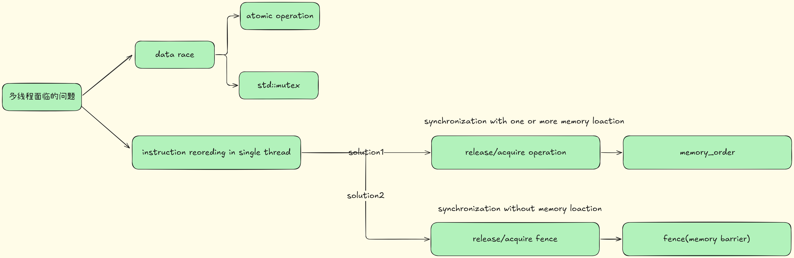

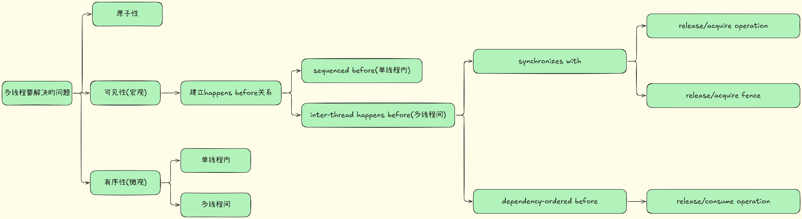

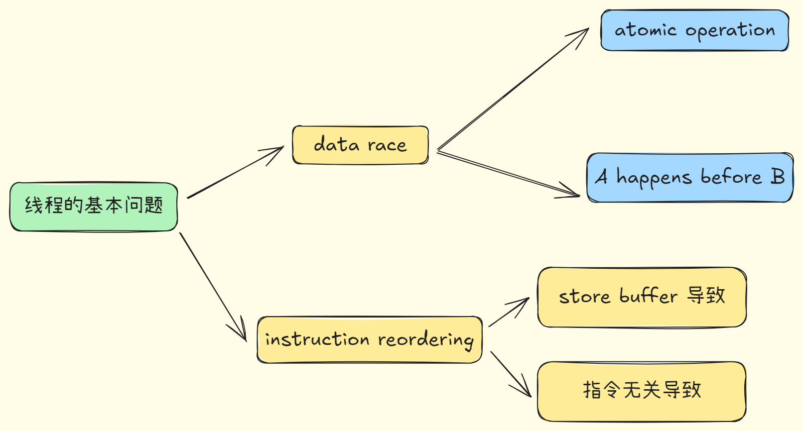


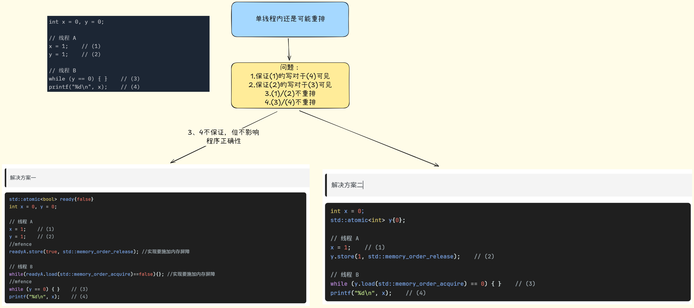

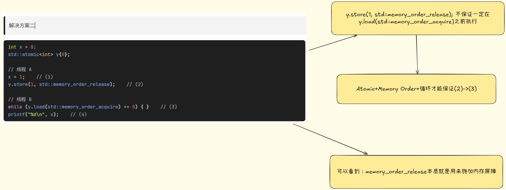


## 4. 并发编程关注问题(宏观)

1. 可见性（Visibility）  
   线程 A 对某变量写入后，线程 B 什么时候能“看”到这次写入？  

2. 原子性（Atomicity）  
   多个线程并发更新同一变量，如何保证不会出现“半更新”或“撕裂（tearing）”？  

3. 有序性（Ordering）  
   编译器/CPU 为了优化，会对普通内存操作做重排序；但我们往往需要“先写入 A，再写入 B，最后通知别的线程”这样的约定。 

4. 互斥/同步（Mutual Exclusion / Coordination）  
   多线程之间怎样协作（如生产者-消费者、读写锁、条件等待……）？


### 解决方案：

### 1. 原子性

- 在硬件层面借助 CPU 原子指令（例如 x86 的 `LOCK XCHG`, ARM 的 `LDREX/STREX`）；
- 在语言层面：
  - 单个变量的原子性 `std::atomic<T>`
  - 多个操作的原子性：`std::mutex`


### 2. 有序性 + 可见性

- 在硬件层面借助 CPU fence
- 在语言层面
  1. 定义「何时可见」，「happens‑before」关系
  2. 通过`std::atomic<T>`和`std::memory_order`实现happens-before关系
  3. 通过`std::atomic_thread_fence`和`std::memory_order`实现happens-before关系
- 个人思考:
  - 有序性和可见性是一体两面
  - 单个线程的指令重排遵循sequenced before关系，不会导致问题
  - 由于对`多个共享变量`的访问，导致线程A的指令重排和线程B的指令重排互相产生影响。即单个线程内的有序性影响了线程间的可见性(由于多个共享变量存在)


# 2. C++提供的解决方案


## 1. atomic

An atomic operation A that performs a release operation on an atomic object M synchronizes with an atomic operation B that performs an acquire operation on M and takes its value from any side effect in the release sequence headed by A.


## 2. mutex

> Motivation：线程内多条语句需要保证原子性(由于程序逻辑和对共享变量的访问)
>
> 可能实现：基于 原子操作 + 自旋/系统调用

### 1.std::mutex为什么delete copy/move

1. 资源唯一性  
   - `std::mutex` 底层往往封装了一个操作系统的互斥对象（比如 Windows 的 `HANDLE`、POSIX 的 `pthread_mutex_t` 等），这个对象在内核层面就是“唯一”的。  
   - 如果允许拷贝，就会出现两个 `std::mutex` 对象指向同一个底层句柄／内核对象，导致：  
     1. 一方 `lock()`，另一方也被锁；  
     2. 一方 `unlock()`，会影响到另一方的状态——极易引发竞态和死锁。

2. 生命周期与状态不透明  
   - 如果可拷贝/可移动，那被拷贝／被移动后，原来的 `mutex`、新的 `mutex` 应该是什么状态？  
   - 要么两者都“持有同一个锁”，要么都“不持有锁”，要么一个持有一个不持有……都缺乏清晰、统一的语义。

3. 安全性和简化实现  
   - 删除拷贝/移动操作，强制你通过引用（或指针、`unique_ptr`、`shared_ptr`）来使用 mutex，也就天然保证了：  
     1. 你不会不经意地复制一个锁对象；  
     2. 资源的所有权和使用方式都更可控、更容易推理。


## 3. memory_order

```c++
namespace std {
enum class memory_order : unspecified {
relaxed, consume, acquire, release, acq_rel, seq_cst
};
}
```

The enumeration memory_order specifies the detailed regular (non-atomic) memory synchronization order as defined in 6.9.2 and may provide for operation ordering. 

Its enumerated values and their meanings are as follows:

1. memory_order::relaxed : no operation orders memory.
2. memory_order::release, memory_order::acq_rel, and memory_order::seq_cst: 
   - a store operation performs a release operation on the affected memory location.
3. memory_order::consume: 
   - a load operation performs a consume operation on the affected memory location.
4. memory_order::acquire, memory_order::acq_rel, and memory_order::seq_cst: 
   - a load operation performs an acquire operation on the affected memory location.

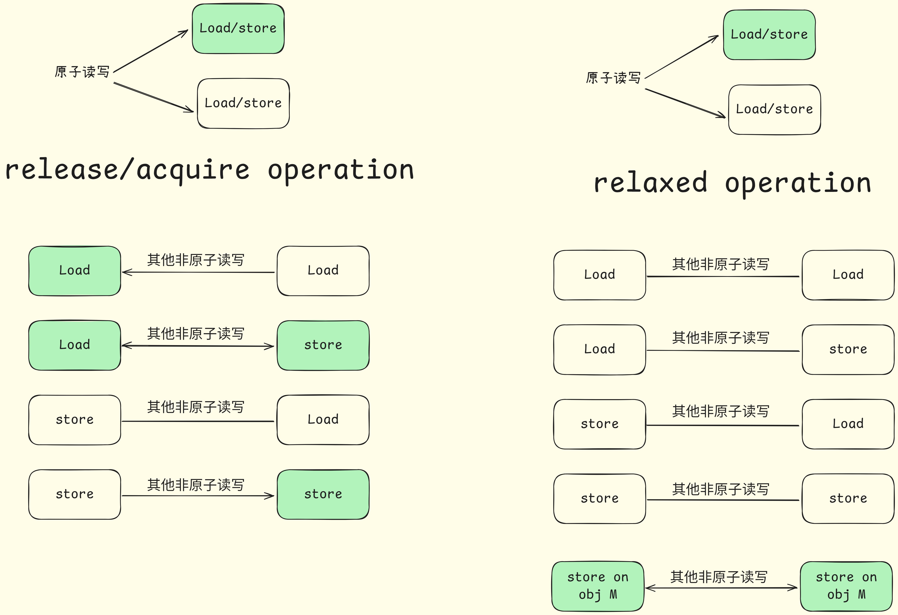

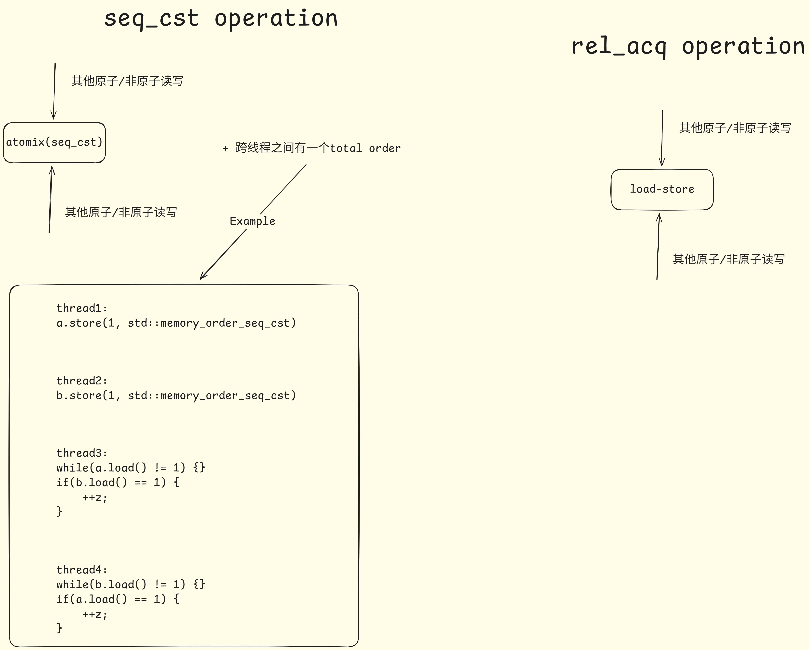


## 4. fence

This subclause introduces synchronization primitives called fences. Fences can have acquire semantics, release semantics, or both. A fence with acquire semantics is called an acquire fence. A fence with release semantics is called a release fence

A release fence A synchronizes with an acquire fence B if there exist atomic operations X and Y , both operating on some atomic object M, such that A is sequenced before X, X modifies M, Y is sequenced before B, and Y reads the value written by X or a value written by any side effect in the hypothetical release sequence X would head if it were a release operation.

A release fence A synchronizes with an atomic operation B that performs an acquire operation on an atomic object M if there exists an atomic operation X such that A is sequenced before X, X modifies M, and B reads the value written by X or a value written by any side effect in the hypothetical release sequence X would head if it were a release operation.

An atomic operation A that is a release operation on an atomic object M synchronizes with an acquire fence B if there exists some atomic operation X on M such that X is sequenced before B and reads the value written by A or a value written by any side effect in the release sequence headed by A.

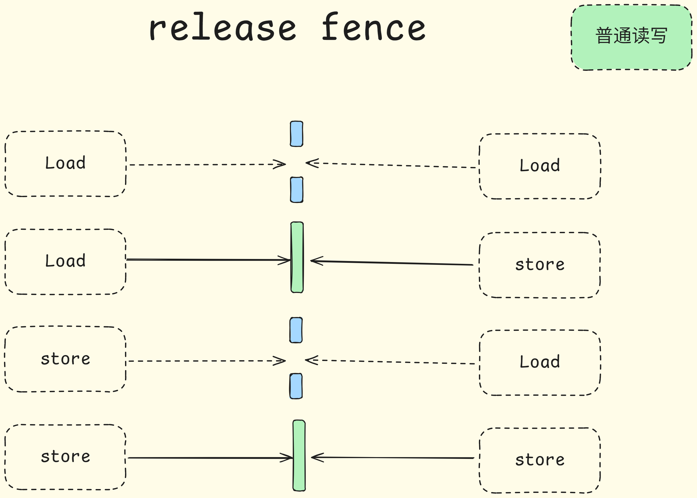

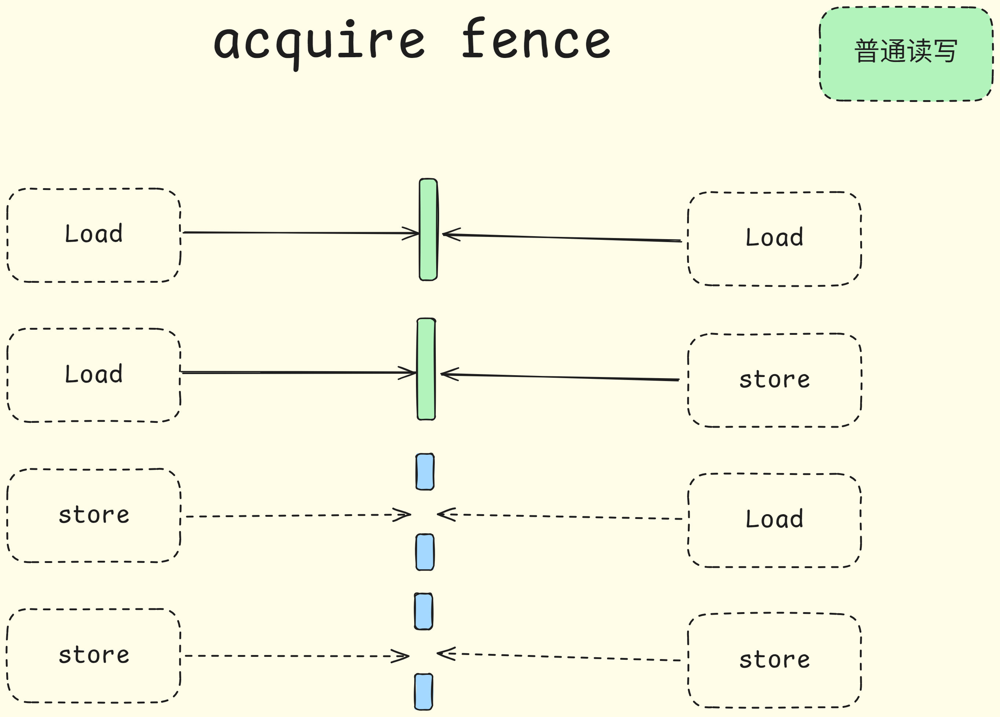

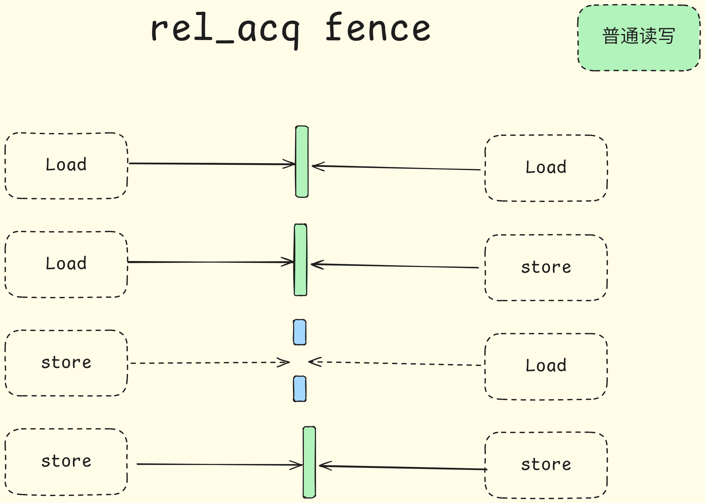


# 3. 高级抽象工具

## lock_guard/unique_lock

> Motivation：std::mutex封装，实现了RAII和更灵活的加锁机制


## condition_variable

> Motivation：线程间需要有一种通信机制来协调两个线程部分代码的执行顺序
>
> - condition_variable 本身通常不是直接用 std::atomic 实现其核心等待/通知机制（这通常依赖操作系统内核支持）。

### 基本用法：

```c++
std::mutex mtx;
bool ready{false};
std::condition_variable cv;

std::unique_lock(mtx);
cv.wait(lock, []{return ready;});

std::unique_lock(mtx);
ready = true;
cv.notify_one();
```


## Semaphore

> Motivation: 一种计数信号量，用于控制对有限数量资源的并发访问。它维护一个内部计数器。
>
> - 信号量的**内部计数器**很可能是用 std::atomic 类型（例如 std::atomic<ptrdiff_t>）来实现的，以确保对计数器的增减操作是线程安全的，而不需要额外的互斥锁来保护这个计数器本身。
> - 尽管计数器是原子的，但 acquire 操作在计数器为0时仍需要阻塞线程，这部分通常不是仅靠 atomic 就能高效实现的，而是结合了操作系统提供的阻塞机制。


## latch/barrier

> Motivation: 
>
> 1. latch: 一种单次使用的线程协调点。线程可以在门闩上等待，直到一个内部计数器减到零。一旦计数器为零，所有等待的线程都被释放，并且门闩状态不能被重置。
>    - std::latch 的**内部计数器**几乎肯定是用 std::atomic 来实现的，以确保 count_down 和 arrive_and_wait 对计数器的修改是原子的。
>    - 当计数器达到零时，需要一种机制来唤醒所有等待的线程，这可能涉及到类似条件变量的内部机制
> 2. barrier: 种可重用的线程协调点。一组线程在屏障处同步。当指定数量的线程到达屏障后，它们可以一起继续执行。屏障可以被重置以供下一阶段使用。
>    - 与 std::latch 类似，std::barrier 的**内部计数器**（用于计算到达的线程数）会使用 std::atomic 实现。
>    - 屏障在所有线程到达后，需要唤醒它们，并在阶段完成时（如果定义了完成函数）执行回调，这可能涉及到更复杂的内部同步。
>
> 


## future & promise

> Motivation: std::future 和 std::promise 是 C++ 标准库中用于**异步编程**的核心组件，它们提供了一种在线程之间传递**单个一次性结果**（值或异常）的机制。

- **std::promise<T> (承诺)**:
  - 代表“未来的写入端”或“结果的提供者”。
  - 生产者线程创建一个 std::promise<T> 对象。
  - 当计算完成时，生产者通过 promise 的 set_value(value) 方法存入结果，或者如果发生错误，则通过 set_exception(exception_ptr) 存入一个异常。
  - 一个 promise 只能被满足一次（通过 set_value 或 set_exception）。
  - promise 对象通常不能被拷贝，只能被移动。
- **std::future<T> (期望)**:
  - 代表“未来的读取端”或“结果的接收者”。
  - 与一个 promise 相关联。可以通过调用 promise.get_future() 来从 promise 对象获取其关联的 future。
  - 消费者线程持有这个 future 对象。
  - 当消费者线程需要结果时，它调用 future 的 get() 方法。
    - 如果生产者已经通过 promise 设置了值（或异常），get() 会立即返回该值（或抛出该异常）。
    - 如果生产者还没有设置值，get() 会**阻塞**当前线程，直到值被设置。
  - future<T>::get() 只能被调用一次（对于非 shared_future）。一旦调用，future 的状态就变为无效。
  - future 还提供了非阻塞的检查方法，如 wait_for()、wait_until() 来查询状态或等待一段时间。


# 4. 对thread更高级的抽象

## 1. std::async/task


## 2. coroutine

### 阻塞函数改造coroutine

将一个阻塞函数改造成 C++20 协程（coroutine）是一个很好的实践，可以提高程序的并发性和响应性，而无需显式管理线程。下面是一步步的改造过程和解释。

假设我们有一个简单的阻塞函数，例如从套接字读取数据：

```cpp
// 伪代码，仅为演示
#include <string>
#include <iostream>
#include <unistd.h> // For read (POSIX)
#include <stdexcept> // For runtime_error

// 假设这是一个模拟的阻塞读取函数
std::string blocking_read_from_socket(int sockfd) {
    std::cout << "blocking_read_from_socket: Starting read on fd " << sockfd << std::endl;
    char buffer[1024];
    // read() 是一个阻塞调用
    ssize_t bytes_read = read(sockfd, buffer, sizeof(buffer) - 1);
    sleep(2); // 模拟耗时操作

    if (bytes_read < 0) {
        throw std::runtime_error("Read error");
    } else if (bytes_read == 0) {
        std::cout << "blocking_read_from_socket: Connection closed by peer on fd " << sockfd << std::endl;
        return ""; // Or throw an exception for EOF
    } else {
        buffer[bytes_read] = '\0';
        std::cout << "blocking_read_from_socket: Read '" << buffer << "' on fd " << sockfd << std::endl;
        return std::string(buffer);
    }
}
```

目标是将 `blocking_read_from_socket` 改造为非阻塞的协程版本。

**核心概念：**

1.  **协程返回类型 (Coroutine Return Type):** 协程函数不能返回普通类型。它必须返回一个满足特定接口的类型（通常称为 `Task`, `Future`, `Generator` 等）。这个类型内部会有一个 `promise_type`。
2.  **`promise_type`:** 这是协程机制的核心。编译器会为每个协程生成一个 `promise` 对象。它负责：
    *   创建协程的返回对象 (`get_return_object()`)。
    *   协程开始时做什么 (`initial_suspend()`)。
    *   协程结束时做什么 (`final_suspend()`)。
    *   处理 `co_return` 的值 (`return_value()` 或 `return_void()`)。
    *   处理 `co_yield` 的值 (`yield_value()`)。
    *   处理未捕获的异常 (`unhandled_exception()`)。
3.  **Awaiter:** `co_await` 关键字后面跟的是一个 "Awaiter" 对象。Awaiter对象必须实现三个特殊方法：
    *   `await_ready()`: 返回 `bool`。如果为 `true`，表示操作已完成，无需挂起，直接调用 `await_resume()`。
    *   `await_suspend(std::coroutine_handle<> h)`: 当 `await_ready()` 返回 `false` 时调用。`h` 是当前协程的句柄。此函数负责安排异步操作，并在操作完成时通过 `h.resume()` 恢复协程。它可以返回 `void` (挂起协程)、`bool` (如果 `false`，则不挂起，立即恢复)、或另一个 `std::coroutine_handle<>` (转移执行权)。
    *   `await_resume()`: 当协程恢复时调用（无论是因为 `await_ready()` 返回 `true` 还是因为 `await_suspend` 中异步操作完成并调用了 `resume()`）。此函数的返回值就是 `co_await` 表达式的结果。

---

**改造步骤：**

**Step 0: 准备 (包含头文件和基本结构)**
需要 `<coroutine>` 头文件 (C++20)。

**Step 1: 定义协程返回类型 (`Task<T>`)**
我们需要一个通用的 `Task<T>` 类型来表示异步操作的结果。

```cpp
#include <coroutine>
#include <exception> // std::exception_ptr, std::current_exception
#include <future>    // std::promise, std::future (for simple result passing)
#include <iostream>
#include <thread>    // For simulating async operations

// 前向声明
template<typename T>
struct Task;

namespace detail { // 辅助结构体，不直接暴露
template<typename T>
struct PromiseBase {
    std::promise<T> result_promise; // 用于传递结果或异常

    auto get_return_object() { // 返回 Task<T>
        return Task<T>{std::coroutine_handle<PromiseBase<T>>::from_promise(*this)};
    }

    std::suspend_always initial_suspend() noexcept { return {}; } // 协程创建后立即挂起
    std::suspend_always final_suspend() noexcept { // 协程结束后挂起
        // 如果有等待者，可以在这里通知它
        return {};
    }
    void unhandled_exception() {
        result_promise.set_exception(std::current_exception());
    }
};

// 特化 void 返回类型
template<>
struct PromiseBase<void> {
    std::promise<void> result_promise;

    auto get_return_object() {
        return Task<void>{std::coroutine_handle<PromiseBase<void>>::from_promise(*this)};
    }
    std::suspend_always initial_suspend() noexcept { return {}; }
    std::suspend_always final_suspend() noexcept { return {}; }
    void unhandled_exception() {
        result_promise.set_exception(std::current_exception());
    }
    void return_void() {
        result_promise.set_value();
    }
};
} // namespace detail


template<typename T>
struct Task {
public:
    // promise_type 是协程机制要求的内嵌类型
    struct promise_type : public detail::PromiseBase<T> {
        void return_value(T value) { // 处理 co_return value;
            this->result_promise.set_value(std::move(value));
        }
    };

    // 使 Task 本身也成为 Awaitable (可选，但方便链式调用)
    bool await_ready() const noexcept {
        // 如果协程已经完成（例如，如果它是通过立即就绪的值创建的）
        // 对于从coroutine_handle创建的Task，通常它不会立即就绪
        //除非initial_suspend返回suspend_never且协程同步完成
        return false; // 简单起见，总是挂起等待
    }

    void await_suspend(std::coroutine_handle<> awaiting_coro) noexcept {
        // 当 Task 被 co_await 时调用
        // 我们需要将结果传递给等待的协程
        // 这里可以通过在 final_suspend 中恢复 awaiting_coro，或者让 get() 阻塞
        // 更健壮的实现会将 awaiting_coro 存储起来，在 Task 完成时恢复它
        // 这里我们通过 future.get() 的阻塞行为来简化
        m_handle.resume(); // 如果 Task 还没开始，启动它
        // 实际应用中，这里会把 awaiting_coro 注册为 m_handle 完成时的 continuation
    }

    T await_resume() { // 当 Task 完成时，co_await Task<T> 表达式的结果
        if (m_handle.done()) {
             // 如果 promise_type 使用了 std::promise 来存储结果，这里从 future 获取
            return m_handle.promise().result_promise.get_future().get();
        }
        // 理论上不应该到这里，如果 await_suspend 正确处理了 resume
        throw std::logic_error("await_resume called on non-done coroutine without proper suspension logic");
    }


    // 获取结果 (通常是阻塞的，或返回 std::future)
    T get() {
        if (!m_handle.done()) {
             m_handle.resume(); // 确保协程已启动
        }
        return m_handle.promise().result_promise.get_future().get();
    }

    explicit Task(std::coroutine_handle<promise_type> h) : m_handle(h) {}
    Task(Task&& t) noexcept : m_handle(std::exchange(t.m_handle, nullptr)) {}
    ~Task() {
        if (m_handle) {
            m_handle.destroy();
        }
    }
    Task(const Task&) = delete;
    Task& operator=(const Task&) = delete;
    Task& operator=(Task&& other) noexcept {
        if (this != &other) {
            if (m_handle) m_handle.destroy();
            m_handle = std::exchange(other.m_handle, nullptr);
        }
        return *this;
    }


private:
    std::coroutine_handle<promise_type> m_handle;
};

// Task<void> 特化
template<>
struct Task<void> {
public:
    using promise_type = detail::PromiseBase<void>;

    bool await_ready() const noexcept { return false; }
    void await_suspend(std::coroutine_handle<> awaiting_coro) noexcept {
        m_handle.resume();
        // 实际应用中，这里会把 awaiting_coro 注册为 m_handle 完成时的 continuation
    }
    void await_resume() {
        if (m_handle.done()) {
            m_handle.promise().result_promise.get_future().get();
        } else {
             throw std::logic_error("await_resume called on non-done coroutine without proper suspension logic");
        }
    }

    void get() {
        if (!m_handle.done()) {
            m_handle.resume();
        }
        m_handle.promise().result_promise.get_future().get();
    }

    explicit Task(std::coroutine_handle<promise_type> h) : m_handle(h) {}
    Task(Task&& t) noexcept : m_handle(std::exchange(t.m_handle, nullptr)) {}
    ~Task() {
        if (m_handle) {
            m_handle.destroy();
        }
    }
    Task(const Task&) = delete;
    Task& operator=(const Task&) = delete;
    Task& operator=(Task&& other) noexcept {
        if (this != &other) {
            if (m_handle) m_handle.destroy();
            m_handle = std::exchange(other.m_handle, nullptr);
        }
        return *this;
    }
private:
    std::coroutine_handle<promise_type> m_handle;
};
```
*   `Task<T>::promise_type` 继承自 `detail::PromiseBase<T>`，后者包含了 `get_return_object`, `initial_suspend`, `final_suspend`, `unhandled_exception` 等通用逻辑。
*   `return_value(T value)`: 当协程执行 `co_return some_value;` 时，这个函数被调用，将值存入 `result_promise`。
*   `Task<void>::promise_type::return_void()`: 当协程执行 `co_return;` (对于 `Task<void>`) 时调用。
*   `Task` 构造函数接收一个 `std::coroutine_handle<promise_type>`。
*   `get()` 方法用于（通常是阻塞地）获取协程的结果。
*   `initial_suspend` 返回 `std::suspend_always{}` 表示协程创建后不会立即执行，而是挂起。调用者需要显式 `resume()` 它或通过 `co_await` 启动它。如果返回 `std::suspend_never{}`，协程会立即开始执行直到第一个挂起点或结束。

**Step 2: 创建一个 Awaiter 来包装阻塞操作**
这个 Awaiter 将负责将阻塞操作放到后台（例如，一个线程池），并在操作完成时恢复协程。

```cpp
// 模拟的异步操作执行器
// 在真实场景中，这会是一个 I/O 事件循环 (epoll, kqueue, IOCP) 或线程池
// 为简单起见，我们直接启动一个新线程
struct async_read_awaitable {
    int sockfd_to_read;
    std::string data_read; // 存储读取的数据
    std::exception_ptr exception; // 存储异常

    explicit async_read_awaitable(int fd) : sockfd_to_read(fd) {}

    bool await_ready() const noexcept {
        // 如果我们能以某种方式知道数据已经立即可用（例如，非阻塞IO检查成功）
        // 但对于演示，我们总是假设需要异步操作
        std::cout << "await_ready: for fd " << sockfd_to_read << " -> false" << std::endl;
        return false;
    }

    // 关键点：await_suspend 负责启动异步操作，并安排协程在操作完成后恢复
    void await_suspend(std::coroutine_handle<> h) noexcept {
        std::cout << "await_suspend: for fd " << sockfd_to_read << ". Launching background thread." << std::endl;
        std::thread([this, h]() {
            try {
                // 在后台线程中执行实际的阻塞读取
                data_read = blocking_read_from_socket(sockfd_to_read);
            } catch (...) {
                exception = std::current_exception();
            }
            // 操作完成，恢复协程
            std::cout << "await_suspend: background op for fd " << sockfd_to_read << " done. Resuming coroutine." << std::endl;
            h.resume();
        }).detach(); // 分离线程，让它自行管理生命周期 (简化示例)
    }

    std::string await_resume() {
        std::cout << "await_resume: for fd " << sockfd_to_read << std::endl;
        if (exception) {
            std::rethrow_exception(exception);
        }
        return data_read;
    }
};
```
*   `await_ready()`: 返回 `false`，表示我们总是需要挂起并执行异步操作。
*   `await_suspend(std::coroutine_handle<> h)`:
    *   接收当前协程的句柄 `h`。
    *   启动一个新线程来执行原来的 `blocking_read_from_socket`。
    *   **重要：** 当后台线程中的操作完成后，它调用 `h.resume()` 来恢复挂起的协程。
    *   异常处理：如果在后台线程中发生异常，我们捕获它并存储到 `exception_ptr`。
*   `await_resume()`:
    *   当协程恢复时（在 `h.resume()` 调用后），此函数被调用。
    *   它返回 `co_await` 表达式的结果。这里是读取到的字符串。
    *   如果之前捕获了异常，则重新抛出。

**Step 3: 修改原函数为协程**
现在，我们可以将 `blocking_read_from_socket` 改写成使用 `co_await` 的协程。

```cpp
Task<std::string> coroutine_read_from_socket(int sockfd) {
    std::cout << "coroutine_read_from_socket: Entered for fd " << sockfd << std::endl;
    try {
        // co_await 会挂起当前协程，直到 async_read_awaitable 完成
        // 然后 await_resume() 的结果会被赋给 local_data
        std::string local_data = co_await async_read_awaitable{sockfd};
        std::cout << "coroutine_read_from_socket: Resumed for fd " << sockfd << ", data: '" << local_data << "'" << std::endl;
        co_return local_data; // 使用 co_return 返回结果
    } catch (const std::exception& e) {
        std::cerr << "coroutine_read_from_socket: Exception for fd " << sockfd << ": " << e.what() << std::endl;
        // 协程中抛出的异常会被 promise_type::unhandled_exception() 捕获
        // 并设置到 Task 的 future 中
        throw; // 重新抛出，让 promise_type 处理
    }
}
```
*   函数返回类型变为 `Task<std::string>`。
*   使用 `co_await async_read_awaitable{sockfd}` 来代替直接调用阻塞函数。
*   使用 `co_return` 返回结果。

**Step 4: 如何调用和运行协程**

```cpp
// 为了测试，我们需要模拟一个 socket 文件描述符和一些数据源
// 这里使用 pipe 来模拟
#include <fcntl.h> // fcntl
#include <sys/socket.h> // socketpair (也可以用 pipe)

int main() {
    // 创建一个 pipe 用于测试，fd_pair[0] 是读端，fd_pair[1] 是写端
    int fd_pair[2];
    if (pipe(fd_pair) == -1) {
        perror("pipe");
        return 1;
    }

    // 使读端非阻塞（可选，但协程通常与非阻塞IO配合）
    // int flags = fcntl(fd_pair[0], F_GETFL, 0);
    // fcntl(fd_pair[0], F_SETFL, flags | O_NONBLOCK);


    std::cout << "Main: Calling coroutine_read_from_socket for fd " << fd_pair[0] << std::endl;
    Task<std::string> my_task = coroutine_read_from_socket(fd_pair[0]);
    // 此时，coroutine_read_from_socket 可能已经开始执行并挂起在 co_await 点
    // (取决于 Task 的 initial_suspend 设置，我们的是 suspend_always，所以需要显式启动或 co_await 它)

    std::cout << "Main: Coroutine created. Task object obtained." << std::endl;
    std::cout << "Main: Doing other work..." << std::endl;
    std::this_thread::sleep_for(std::chrono::milliseconds(500)); // 模拟主线程做其他事情

    // 启动一个线程向 pipe 写入数据，模拟外部事件
    std::thread writer_thread([&]() {
        std::cout << "WriterThread: Sleeping for 1 sec before writing..." << std::endl;
        std::this_thread::sleep_for(std::chrono::seconds(1));
        const char* msg = "Hello from pipe!";
        std::cout << "WriterThread: Writing '" << msg << "' to fd " << fd_pair[1] << std::endl;
        write(fd_pair[1], msg, strlen(msg));
        // close(fd_pair[1]); // 关闭写端，这样读端会收到EOF (bytes_read == 0)
    });
    writer_thread.detach();


    std::cout << "Main: Waiting for task to complete..." << std::endl;
    try {
        // my_task.get() 会启动协程（如果 initial_suspend 是 suspend_always 且未启动）
        // 并且阻塞等待协程完成并返回结果
        std::string result = my_task.get(); // .get() 会 resume 协程 (如果需要) 并等待 future
        std::cout << "Main: Task completed. Result: '" << result << "'" << std::endl;
    } catch (const std::exception& e) {
        std::cerr << "Main: Exception from task: " << e.what() << std::endl;
    }

    // 关闭文件描述符
    close(fd_pair[0]);
    close(fd_pair[1]);

    std::cout << "Main: Exiting." << std::endl;
    // 由于 async_read_awaitable 中的线程是 detached 的，主线程可能先退出
    // 在实际应用中，需要更好的线程管理和事件循环
    std::this_thread::sleep_for(std::chrono::seconds(3)); // 等待后台线程打印完日志

    return 0;
}

/*
可能的输出顺序 (会因线程调度而略有不同):

Main: Calling coroutine_read_from_socket for fd 3
coroutine_read_from_socket: Entered for fd 3
await_ready: for fd 3 -> false
await_suspend: for fd 3. Launching background thread.
blocking_read_from_socket: Starting read on fd 3       // (in background thread)
Main: Coroutine created. Task object obtained.
Main: Doing other work...
WriterThread: Sleeping for 1 sec before writing...
Main: Waiting for task to complete...                  // Main thread calls my_task.get(), which resumes coroutine if needed and blocks on future
WriterThread: Writing 'Hello from pipe!' to fd 4
blocking_read_from_socket: Read 'Hello from pipe!' on fd 3 // (in background thread after 2s sleep)
await_suspend: background op for fd 3 done. Resuming coroutine. // (in background thread)
coroutine_read_from_socket: Resumed for fd 3, data: 'Hello from pipe!' // (coroutine resumes)
await_resume: for fd 3                                 // (coroutine execution continues)
Main: Task completed. Result: 'Hello from pipe!'
Main: Exiting.
(后台线程的日志可能在Main退出后才完全显示，取决于sleep(3)和调度)
*/
```

**编译 (需要 C++20 支持):**
`g++ -std=c++20 -fcoroutines -pthread your_file.cpp -o your_program`
`clang++ -std=c++20 -fcoroutines-ts -pthread your_file.cpp -o your_program` (老版本 Clang 可能用 `-fcoroutines-ts` 和 `<experimental/coroutine>`)

**总结与关键点：**

1.  **分离关注点：**
    *   **协程本身 (`coroutine_read_from_socket`)**: 只关心业务逻辑和在哪里 `co_await`。
    *   **Awaitable (`async_read_awaitable`)**: 封装异步操作的启动和完成通知。这是将阻塞调用转换为非阻塞的关键。它与具体的异步机制（线程、epoll、io_uring、Boost.Asio等）交互。
    *   **Task (`Task<T>`)**: 作为协程的返回类型，管理协程的生命周期和结果传递。

2.  **执行上下文：**
    *   `await_suspend` 通常将耗时操作调度到其他地方执行（如另一个线程或I/O事件循环）。
    *   当异步操作完成时，通过 `coroutine_handle::resume()` 在原始或指定的上下文中恢复协程。
    *   在这个例子中，`async_read_awaitable` 使用 `std::thread` 模拟了异步执行。在生产环境中，你会使用一个更高效的事件循环或线程池。

3.  **`initial_suspend` 的选择：**
    *   `std::suspend_always{}`: 协程创建后不立即执行，调用者必须显式启动（如通过 `task.resume()` 或当 `Task` 被 `co_await` 时）。这允许 "冷启动" 任务。
    *   `std::suspend_never{}`: 协程创建后立即执行，直到第一个 `co_await` (它自己导致挂起) 或协程结束。这允许 "热启动"。

4.  **错误处理：** 协程中抛出的异常会被 `promise_type::unhandled_exception()` 捕获，并通常通过 `std::promise` 或类似机制传递给 `Task` 的等待者。

这种改造使得原先会阻塞调用线程的函数变成了一个可以挂起和恢复的协程，允许调用线程在等待 I/O 时去做其他事情，从而提高整体的并发性和响应性，尤其是在单线程事件循环模型中。


### co_await/awaitable/awaiter

| 名字          | 你写代码里的角色                           | 必须实现什么？                                     |
| ------------- | ------------------------------------------ | -------------------------------------------------- |
| **awaitable** | 写在 `co_await` 右边的**任何表达式**       | 没硬性要求                                         |
| **awaiter**   | 真正参与 “ready/suspend/resume” 协议的对象 | `await_ready()` `await_suspend()` `await_resume()` |

编译器看到 `co_await expr` 时，会先把 **expr (awaitable)** **“变”成 awaiter**，步骤如下：

1. 如果 `expr.operator co_await()` 存在 → 调用它，返回值就是 awaiter  
2. 否则如果有 ADL 找到 `operator co_await(expr)` → 也是 awaiter  
3. 都没有？那 `expr` 自己就直接当 awaiter，用它身上的 `await_ready()` … 三函数

所以**awaitable 只是“原料”，awaiter 才是干活的人**。  
很多库里把两者合在一起写，所以你常常感觉它们“没有区别”——实则角色不同。

```c++
#include <coroutine>
#include <iostream>

/* ---------- awaiter ---------- */
struct MyAwaiter {
    bool await_ready() {            // 立刻就绪?
        std::cout << "ready?\n";
        return false;               // 假设总要挂起
    }
    void await_suspend(std::coroutine_handle<> h) {
        std::cout << "suspend\n";
        /* 做完异步事后… */ h.resume();      // 叫醒
    }
    int await_resume() {            // 恢复时给出结果
        std::cout << "resume\n";
        return 42;
    }
};

/* ---------- awaitable ---------- */
struct MyAwaitable {
    MyAwaiter operator co_await() const {     // 把“单”派给“小哥”
        return {};
    }
};

/* ---------- 协程 ---------- */
struct task {
    struct promise_type {
        task get_return_object() { return {}; }
        std::suspend_never initial_suspend() { return {}; }
        std::suspend_never final_suspend() noexcept { return {}; }
        void return_void() {}
        void unhandled_exception() {}
    };
};

task demo() {
    int v = co_await MyAwaitable{};   // ← 这里写的是 awaitable
    std::cout << "value = " << v << '\n';
}

int main() { demo(); }
```

如果你嫌麻烦，直接让一个类型同时充当 awaitable & awaiter：

```c++
struct Both {
    bool await_ready() { return false; }
    void await_suspend(std::coroutine_handle<> h){ h.resume(); }
    int  await_resume() { return 666; }
};

int v = co_await Both{};   // 无 operator co_await，但自身满足三函数 ➜ 被当 awaiter
```

这就是 `std::suspend_always / suspend_never` 的做法。

什么时候需要拆成俩？

1. **复用**：同一个 awaiter 可以从不同 awaitable 生成  
2. **保存状态**：awaitable 只是对外接口，awaiter 内含执行时的细节  
3. **语义更清晰**：例如网络库里  
   - awaitable = “发起 HTTP 请求”  
   - awaiter   = “具体等待网络返回、解析、唤醒协程”  


# 5. 其他重要概念


## 1.Thread-Local Data

在 C++ 中，**线程局部数据 (Thread-Local Data)**，也称为线程本地存储 (Thread-Local Storage, TLS)，指的是一种特殊的变量存储方式。这种变量虽然在代码中可能看起来像全局变量或静态变量，但实际上**每个线程都拥有它自己独立的一份副本**。

这意味着：
1.  当一个线程修改其线程局部数据副本时，不会影响其他线程中的同名变量副本。
2.  每个线程都可以独立地读取和写入自己的线程局部数据，而无需进行显式的同步（如互斥锁），因为数据本身就是隔离的。

**为什么需要线程局部数据？**

在多线程编程中，有时我们需要一些数据对于每个线程来说是“全局”的，但又希望每个线程拥有自己独立的状态，以避免：
*   **竞争条件 (Race Conditions):** 如果多个线程共享一个可变数据而没有适当的同步，就会产生竞争条件。
*   **复杂的同步逻辑:** 使用互斥锁等同步机制会增加代码复杂性，并可能导致性能瓶颈。
*   **函数参数传递的繁琐:** 如果某些状态需要在线程的多个函数调用之间共享，通过参数传递会很麻烦。

线程局部数据提供了一种优雅的方式来解决这些问题，使得每个线程可以安全地维护自己的状态。

**如何在 C++ 中声明线程局部数据？**

从 C++11 开始，标准引入了 `thread_local` 存储期说明符。

```cpp
#include <iostream>
#include <thread>
#include <vector>
#include <mutex> // 仅用于同步std::cout的输出，非演示TLS核心

// 声明一个线程局部变量
thread_local int g_thread_specific_data = 0;

// 用于同步std::cout输出的互斥锁
std::mutex cout_mutex;

void thread_function(int thread_id) {
    // 每个线程开始时，g_thread_specific_data 都是 0 (或者其初始值)
    // 或者是该线程第一次访问此变量时进行初始化

    g_thread_specific_data = thread_id * 10; // 修改本线程的副本

    for (int i = 0; i < 3; ++i) {
        g_thread_specific_data++;
        std::lock_guard<std::mutex> lock(cout_mutex); // 保护cout
        std::cout << "Thread ID: " << thread_id
                  << ", g_thread_specific_data = " << g_thread_specific_data
                  << " (Address: " << &g_thread_specific_data << ")" << std::endl;
        std::this_thread::sleep_for(std::chrono::milliseconds(10));
    }
}

int main() {
    std::vector<std::thread> threads;
    for (int i = 0; i < 3; ++i) {
        // 启动线程，并传入一个唯一的id
        threads.emplace_back(thread_function, i + 1);
    }

    for (auto& t : threads) {
        t.join();
    }

    // main线程也有自己的g_thread_specific_data副本
    g_thread_specific_data = 999;
    std::cout << "Main thread, g_thread_specific_data = " << g_thread_specific_data
              << " (Address: " << &g_thread_specific_data << ")" << std::endl;

    return 0;
}
```

**输出示例 (顺序可能不同):**

```
Thread ID: 1, g_thread_specific_data = 11 (Address: 0x7f....)
Thread ID: 2, g_thread_specific_data = 21 (Address: 0x7e....)
Thread ID: 3, g_thread_specific_data = 31 (Address: 0x7d....)
Thread ID: 1, g_thread_specific_data = 12 (Address: 0x7f....)
Thread ID: 2, g_thread_specific_data = 22 (Address: 0x7e....)
Thread ID: 3, g_thread_specific_data = 32 (Address: 0x7d....)
Thread ID: 1, g_thread_specific_data = 13 (Address: 0x7f....)
Thread ID: 2, g_thread_specific_data = 23 (Address: 0x7e....)
Thread ID: 3, g_thread_specific_data = 33 (Address: 0x7d....)
Main thread, g_thread_specific_data = 999 (Address: 0x55....)
```

**关键点：**
*   **`thread_local` 关键字:** 用于声明线程局部变量。
*   **独立副本:** 每个线程（包括 `main` 线程）都有 `g_thread_specific_data` 的一个独立副本。注意观察输出中不同线程的变量地址是不同的。
*   **生命周期:**
    *   线程局部变量在线程启动时创建（或者更准确地说，在该线程首次访问该变量时进行初始化）。
    *   当线程终止时，其线程局部变量会被销毁（如果它们是对象，则会调用析构函数）。
*   **初始化:**
    *   如果提供了初始化器，则每个线程的副本都会被初始化。
    *   如果未提供初始化器，则具有静态存储期的变量会被零初始化，而具有自动存储期规则的变量则具有不确定值（尽管 `thread_local` 通常与静态存储期规则类似，所以它们通常会被零初始化或默认构造）。
*   **适用范围:** `thread_local` 可以用于命名空间作用域的变量、文件作用域的静态变量以及类的静态成员变量。不能用于函数内的非静态局部变量（因为它们本身就是线程局部的，生命周期受函数调用栈限制）。

**常见用例：**
1.  **每个线程的错误码:** 类似 `errno` 的机制，每个线程可以有自己独立的错误状态。
2.  **每个线程的随机数生成器种子:** 确保每个线程的随机数序列不同。
3.  **每个线程的缓存或缓冲区:** 避免对共享缓存的竞争。
4.  **事务ID或日志记录上下文:** 在复杂的调用链中，方便地访问当前线程的特定信息。
5.  **管理非线程安全的库:** 如果一个库不是线程安全的，但又需要在多线程环境中使用，可以将库的句柄或上下文存储在线程局部变量中，确保每个线程使用自己独立的实例。

**注意事项：**
*   **资源消耗:** 如果创建大量线程，并且每个线程都有许多或较大的线程局部变量，可能会消耗较多内存。
*   **“隐式”状态:** 过度使用线程局部变量可能使得代码状态不那么明显，因为它不像函数参数那样显式传递。
*   **析构顺序:** 当线程退出时，线程局部对象的析构顺序与它们构造顺序的逆序相关，但具体细节可能依赖于实现。

总而言之，`thread_local` 是 C++11 提供的一个强大工具，用于简化多线程编程中线程特定状态的管理，有效地避免数据竞争并减少对显式同步的需求。

## 2.Thread-safe Initialization

在C++中，**Thread-safe Initialization**（线程安全的初始化）指的是确保一个对象或资源在多线程环境下能够被正确、安全地初始化，并且只初始化一次，即使有多个线程同时尝试初始化它。

这主要涉及到以下几个关键点：

1.  **只初始化一次 (Initialization Once)**：无论多少线程尝试访问或初始化该对象，其初始化代码（例如构造函数）只会被执行一次。
2.  **防止竞争条件 (Race Condition Prevention)**：在初始化过程中，不能出现竞争条件，导致数据损坏或者不一致的状态。
3.  **可见性 (Visibility)**：一旦对象初始化完成，其状态必须对所有后续访问该对象的线程可见。
4.  **避免死锁 (Deadlock Avoidance)**：初始化过程不应引入死锁的风险。

### 为什么需要线程安全的初始化？

在单线程程序中，对象的初始化顺序通常是明确的。但在多线程程序中，如果多个线程可能在首次访问时触发某个共享对象（特别是静态对象或单例）的初始化，就可能发生问题：

*   **多次初始化**：如果没有任何同步机制，每个线程都可能认为自己是第一个，从而多次执行初始化代码，这可能导致资源泄露、状态错误等。
*   **数据竞争**：即使只初始化一次，如果初始化过程本身不是原子的，多个线程可能同时修改对象的内部状态，导致数据损坏。
*   **部分初始化**：一个线程可能看到一个尚未完全初始化的对象。

### C++中实现线程安全初始化的方法

C++标准库和语言特性提供了几种实现线程安全初始化的方法：

1.  **C++11及更高版本：静态局部变量 (Magic Statics)**
    这是最推荐且最简单的方法。从C++11开始，标准规定函数内的静态局部变量的初始化是线程安全的。

    ```cpp
    class Singleton {
    public:
        static Singleton& getInstance() {
            // C++11 guarantees this initialization is thread-safe
            static Singleton instance; // Initialized only once
            return instance;
        }
    
    private:
        Singleton() {
            // Constructor logic
            std::cout << "Singleton instance created." << std::endl;
        }
        ~Singleton() {
            std::cout << "Singleton instance destroyed." << std::endl;
        }
        Singleton(const Singleton&) = delete;
        Singleton& operator=(const Singleton&) = delete;
    };
    
    // Usage:
    // Singleton& s1 = Singleton::getInstance();
    // Singleton& s2 = Singleton::getInstance(); // s1 and s2 refer to the same object
    ```
    编译器和运行时库会自动处理同步问题，确保`instance`只被构造一次。通常，这会通过一个内部的互斥锁或者其他高效的同步原语来实现，但对开发者是透明的。

2.  **`std::call_once` 和 `std::once_flag` (C++11及更高版本)**
    `std::call_once` 配合 `std::once_flag` 可以确保某个函数（通常是初始化函数）在多线程环境下只被调用一次。

    ```cpp
    #include <iostream>
    #include <thread>
    #include <mutex> // For std::once_flag and std::call_once
    #include <vector>
    
    class MyResource {
    public:
        MyResource() {
            std::cout << "MyResource created by thread " << std::this_thread::get_id() << std::endl;
            // Simulate some work
            std::this_thread::sleep_for(std::chrono::milliseconds(100));
        }
        void use() {
            std::cout << "MyResource used by thread " << std::this_thread::get_id() << std::endl;
        }
    };
    
    std::once_flag resource_flag;
    MyResource* resource_ptr = nullptr;
    
    void init_resource() {
        resource_ptr = new MyResource();
    }
    
    MyResource* get_resource() {
        std::call_once(resource_flag, init_resource); // init_resource will be called only once
        return resource_ptr;
    }
    
    int main() {
        std::vector<std::thread> threads;
        for (int i = 0; i < 5; ++i) {
            threads.emplace_back([]() {
                MyResource* res = get_resource();
                res->use();
            });
        }
    
        for (auto& t : threads) {
            t.join();
        }
    
        delete resource_ptr; // Remember to clean up if manually allocated
        return 0;
    }
    ```
    `std::call_once` 对于比简单静态局部变量更复杂的初始化场景非常有用，比如当初始化需要多个步骤或者依赖于外部条件时。

3.  **Constant expressions**
    
    
    
    

### 总结

*   **对于静态局部变量的延迟初始化，C++11的“magic statics”是首选方案**，它简洁、安全且由标准保证。
*   对于更复杂的初始化逻辑，或者当初始化需要在特定代码路径中显式触发时，`std::call_once` 是一个强大且标准的工具。

线程安全的初始化是构建健壮并发应用程序的基础。C++11及更高版本提供的工具大大简化了这一任务。


# 6. 相关术语

## data race

The execution of a program contains a data race if it contains two `potentially concurrent` conflicting actions, at least one of which is not atomic, and neither happens before the other, except for the special case for signal handlers described below. Any such data race results in undefined behavior.


## conflict

Two expression evaluations conflict if one of them modifies a memory location (6.7.1) and the other one reads or modifies the same memory location.


## potentially concurrent

Two actions are potentially concurrent if

- they are performed by different threads, or
- they are unsequenced, at least one is performed by a signal handler, and they are not both performed by the same signal handler invocation


## synchronization operations

The library defines a number of atomic operations (33.5) and operations on mutexes (Clause 33) that are specially identified as synchronization operations.

These operations play a special role in making assignments in one thread visible to another. 

1. A synchronization operation on one or more memory locations is either a consume operation, an acquire operation, a release operation, or both an acquire and release operation.
2. A synchronization operation without an associated memory location is a fence and can be either an acquire fence, a release fence, or both an acquire and release fence. 

In addition, there are relaxed atomic operations, which are not synchronization operations, and atomic read-modify-write operations, which have special characteristics.

For example, a call that acquires a mutex will perform an acquire operation on the locations comprising the mutex. Correspondingly, a call that releases the same mutex will perform a release operation on those same locations. 

Informally, performing a release operation on A **forces prior side effects on other memory locations to become visible** to other threads that later perform a consume or an acquire operation on A. 

“Relaxed” atomic operations are not synchronization operations even though, like synchronization operations, they never contribute to data races.

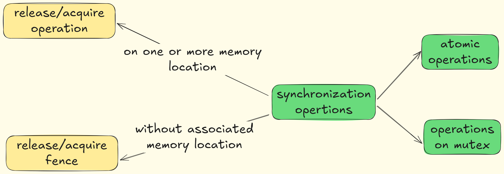


## modification order

All modifications to a particular atomic object M occur in some particular total order, called the modification order of M.

There is a separate order for each atomic object. There is no requirement that these can be combined into a single total order for all objects. In general this will be impossible since different threads can observe modifications to different objects in inconsistent orders.


## release sequence

A release sequence headed by a release operation A on an atomic object M is a maximal contiguous subsequence of side effects in the modification order of M, where `the first operation is A, and every subsequent operation is an atomic read-modify-write operation.`


## synchronize with

Certain library calls synchronize with other library calls performed by another thread. 

For example, an atomic store-release synchronizes with a load-acquire that takes its value from the store (33.5.4).

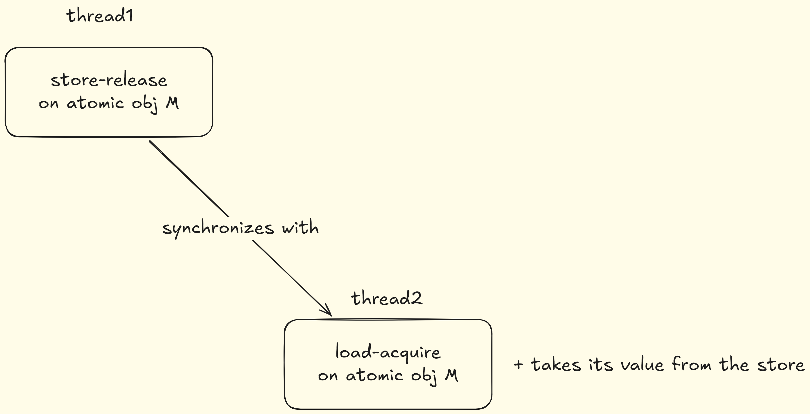

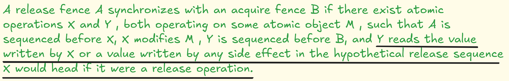

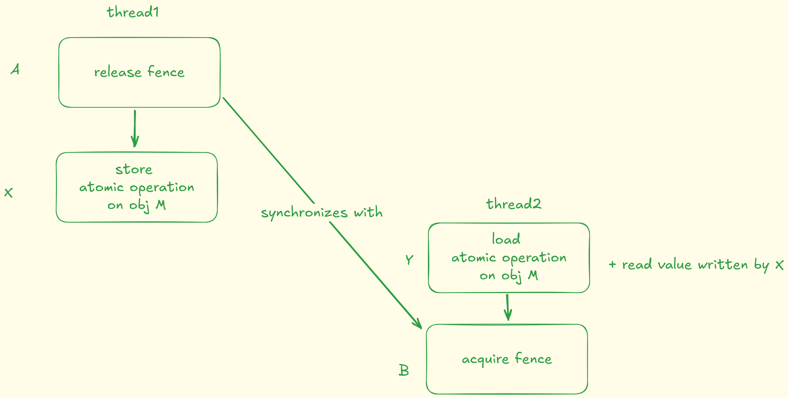


## carries a dependency

An evaluation A carries a dependency to an evaluation B if 

- the value of A is used as an operand of B, unless:
  - B is an invocation of any specialization of std::kill_dependency (33.5.4), or
  - A is the left operand of a built-in logical and (&&, see 7.6.14) or logical or (||, see 7.6.15) operator, or
  - A is the left operand of a conditional (?:, see 7.6.16) operator, or
  - A is the left operand of the built-in comma (,) operator (7.6.20); or
- A writes a scalar object or bit-field M, B reads the value written by A from M, and A is sequenced before B, or
- for some evaluation X, A carries a dependency to X, and X carries a dependency to B.

>  “Carries a dependency to” is a subset of “is sequenced before”, and is similarly strictly intra-thread.


## sequenced before

Sequenced before is an asymmetric, transitive, pair-wise relation between evaluations executed by a single thread (6.9.2), which induces a partial order among those evaluations. 

Given any two evaluations A and B, 

- if A is sequenced before B (or, equivalently, B is sequenced after A), then the execution of A shall precede the execution of B. 
- If A is not sequenced before B and B is not sequenced before A, then A and B are unsequenced.

An expression X is said to be sequenced before an expression Y 

- if every `value computation and every side effect` associated with the expression X is sequenced before every `value computation and every side effect` associated with the expression Y.

Every value computation and side effect associated with a `full-expression` is sequenced before every value computation and side effect associated with `the next full-expression` to be evaluated.

Except where noted, evaluations of operands of individual operators and of subexpressions of individual expressions are unsequenced.

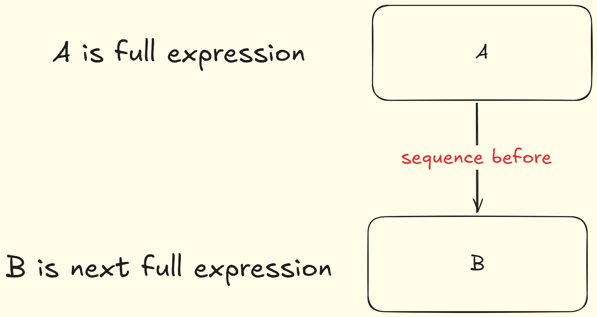


## Value Computation


## Visiable Side Effect

A visible side effect A on a scalar object or bit-field M with respect to a value computation B of M satisfies the conditions:

- A happens before B and
- there is no other side effect X to M such that A happens before X and X happens before B.


## dependency-ordered before

An evaluation A is dependency-ordered before an evaluation B if

- A performs a release operation on an atomic object M, and, in another thread, B performs a consume operation on M and reads the value written by A, or
- for some evaluation X, A is dependency-ordered before X and X carries a dependency to B.

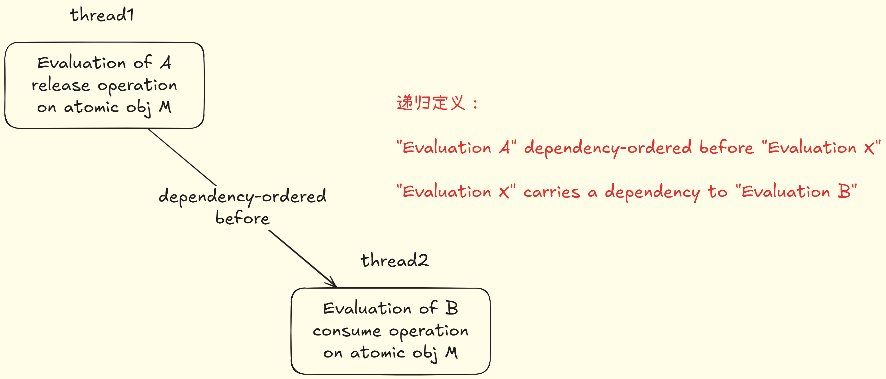


## inter-thread happens before

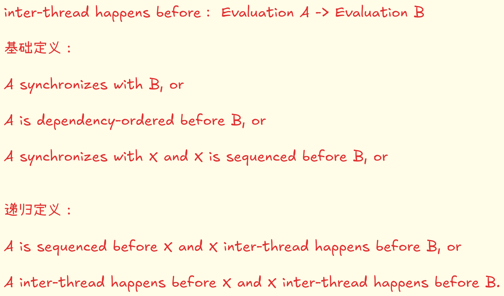


## happens before

An evaluation A happens before an evaluation B (or, equivalently, B happens after A) if

- A is sequenced before B, or
- A inter-thread happens before B


# 7. 问题

## 1.关键词：可见性

> C++中定义happens before保证了可见性，可是单个线程内的有序性是怎么保证的？

在 C++ 的内存模型中，线程间的有序性（visibility）是靠 “happens‐before” 关系（主要通过 release/acquire、seq_cst 原子操作等）来保证的；而单个线程内部，则是靠 “sequenced‐before”（或者说“程序顺序”）来保证的。下面分几步展开：

1. 什么是 Sequenced‐Before  
   – 标准中定义：在同一线程内，“所有值计算（value computation）和副作用（side effect）之间存在一种严格的、不可循环的序关系”——即 sequenced‐before；  
   – **特点**：任何两个在同一线程上的操作，要么 A sequenced‐before B，要么 B sequenced‐before A。编译器必须在不改变单线程可观察行为（as‐if rule）的前提下，保持这种顺序。

2. 语言层面的保证  
   – 每条表达式（如赋值、函数调用、控制流等）都有明确的评估顺序（evaluation order）和 sequenced‐before 关系；  
   – C++17 以后，更多表达式的求值顺序被固定（例如函数实参、加减乘除的计算顺序都有规则），未定义顺序的场景大大减少。  

3. 编译器优化 vs. “as‐if” 规则  
   – 编译器可以对指令进行重排、寄存器分配、寄存器消除等优化；  
   – 但在单线程下，只要最终程序输出（stdout、全局变量可见状态、`volatile` I/O）不变，就允许这些重排；  
   – **也就是说**：编译器不会破坏 sequenced‐before 导致的可观察行为。

4. 小结  
   1) **单线程内部**：靠语言定义的 sequenced‐before（程序顺序）来决定执行次序，编译器只能在不改变可见行为的前提下优化；  
   2) **多线程之间**：靠 happens‐before（原子操作的 release/acquire、mutex unlock/lock、seq_cst 等）来保证可见性和有序性。  

表格对比

|   维度   | 单线程（intra‑thread）       | 多线程（inter‑thread）                  |
| :------: | :--------------------------- | :-------------------------------------- |
| 关键关系 | sequenced‑before (程序顺序)  | happens‑before (release/acquire, mutex) |
| 优化规则 | as‑if rule，不破坏可观察行为 | 受内存序（memory_order）约束            |
| 标准位置 | [intro.execution] / [expr]   | [atomics.order] / [intro.races]         |

总之，在单线程中，你看不到“不可见”的改动——编译器必须尊重标准里的 sequenced‑before 关系，否则就破坏了程序的单线程语义，这恰恰是“有序性”得以保证的根本。


## 2.关键字：什么是同步？

> 个人思考

### 各个线程各自处理自己的事情，某个时刻：

- #### 互斥锁：

  - #### 线程A需要访问临界区代码，此时需要确定线程B不在临界区。此时需要和线程B同步一下:嘿，我要进临界区了，lock!!!

- #### 条件变量

  - #### 线程A需要等待某个条件(这个条件需要线程B修改)满足才能执行下一步操作。此时需要和线程B同步一下：嘿，条件满足了，通知我一下

- #### 信号量：

  - #### 线程A需要获取某个有限的资源，此时没有剩余的资源可用。此时需要和其它线程同步一下：嘿，有资源了通知我一下！！！

  - #### 线程A需要释放某个有限的资源，此时可能有其他线程在等着。此时需要和其它线程同步一下：嘿，有资源，你可以拿走了！！！