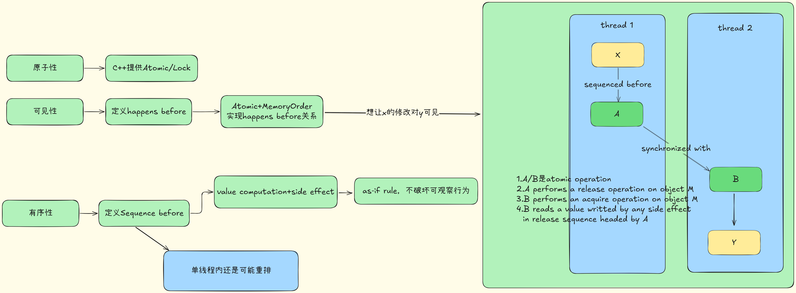

# 1. 多线程的基本问题

## 1. Data Race

```c++
void increment_counter() {
    for (int i = 0; i < ITERATIONS; ++i) {
        shared_counter++; // <--- 数据竞争发生在这里
                          // 非原子操作：读-修改-写
    }
}
```


## 2. Instruction Reorder

```c++
// 共享变量
int data = 0;
bool ready = false; // 如果使用 std::atomic<bool> ready{false}; 可以部分解决问题

void producer() {
    data = 42;          // (1) 写入数据
    // 指令重排可能导致 (2) 在 (1) 之前被其他线程观察到
    ready = true;       // (2) 设置标志位 (没有内存屏障)
}

void consumer() {
    while (!ready) {    // (3) 等待标志位
        // 自旋等待 (实际应用中应使用更高效的等待方式，如条件变量)
        // 或者 std::this_thread::yield();
    }
    // (4) 读取数据
    // 如果 (2) 先于 (1) 被观察到，这里可能读到 data 的旧值 (0)
    std::cout << "Data received: " << data << std::endl;
}
```


## 3. 补充图解





# 2. C++提供的解决方案


## 1. atomic

An atomic operation A that performs a release operation on an atomic object M synchronizes with an atomic operation B that performs an acquire operation on M and takes its value from any side effect in the release sequence headed by A.


## 2. mutex


### 1.std::mutex为什么delete copy/move

1. 资源唯一性  
   - `std::mutex` 底层往往封装了一个操作系统的互斥对象（比如 Windows 的 `HANDLE`、POSIX 的 `pthread_mutex_t` 等），这个对象在内核层面就是“唯一”的。  
   - 如果允许拷贝，就会出现两个 `std::mutex` 对象指向同一个底层句柄／内核对象，导致：  
     1. 一方 `lock()`，另一方也被锁；  
     2. 一方 `unlock()`，会影响到另一方的状态——极易引发竞态和死锁。

2. 生命周期与状态不透明  
   - 如果可拷贝/可移动，那被拷贝／被移动后，原来的 `mutex`、新的 `mutex` 应该是什么状态？  
   - 要么两者都“持有同一个锁”，要么都“不持有锁”，要么一个持有一个不持有……都缺乏清晰、统一的语义。

3. 安全性和简化实现  
   - 删除拷贝/移动操作，强制你通过引用（或指针、`unique_ptr`、`shared_ptr`）来使用 mutex，也就天然保证了：  
     1. 你不会不经意地复制一个锁对象；  
     2. 资源的所有权和使用方式都更可控、更容易推理。


## 3. memory_order

```c++
namespace std {
enum class memory_order : unspecified {
relaxed, consume, acquire, release, acq_rel, seq_cst
};
}
```

The enumeration memory_order specifies the detailed regular (non-atomic) memory synchronization order as defined in 6.9.2 and may provide for operation ordering. 

Its enumerated values and their meanings are as follows:

1. memory_order::relaxed : no operation orders memory.
2. memory_order::release, memory_order::acq_rel, and memory_order::seq_cst: 
   - a store operation performs a release operation on the affected memory location.
3. memory_order::consume: 
   - a load operation performs a consume operation on the affected memory location.
4. memory_order::acquire, memory_order::acq_rel, and memory_order::seq_cst: 
   - a load operation performs an acquire operation on the affected memory location.


## 4. fence

This subclause introduces synchronization primitives called fences. Fences can have acquire semantics, release semantics, or both. A fence with acquire semantics is called an acquire fence. A fence with release semantics is called a release fence

A release fence A synchronizes with an acquire fence B if there exist atomic operations X and Y , both operating on some atomic object M, such that A is sequenced before X, X modifies M, Y is sequenced before B, and Y reads the value written by X or a value written by any side effect in the hypothetical release sequence X would head if it were a release operation.

A release fence A synchronizes with an atomic operation B that performs an acquire operation on an atomic object M if there exists an atomic operation X such that A is sequenced before X, X modifies M, and B reads the value written by X or a value written by any side effect in the hypothetical release sequence X would head if it were a release operation.

An atomic operation A that is a release operation on an atomic object M synchronizes with an acquire fence B if there exists some atomic operation X on M such that X is sequenced before B and reads the value written by A or a value written by any side effect in the release sequence headed by A.


# 3. 高级抽象工具

## lock

## condition_variable


## latch/barrier


## future & promise


# 4.对thread更高级的抽象

## task


## coroutine


# 6. 相关术语

## data race

The execution of a program contains a data race if it contains two `potentially concurrent` conflicting actions, at least one of which is not atomic, and neither happens before the other, except for the special case for signal handlers described below. Any such data race results in undefined behavior.


## conflict

Two expression evaluations conflict if one of them modifies a memory location (6.7.1) and the other one reads or modifies the same memory location.


## potentially concurrent

Two actions are potentially concurrent if

- they are performed by different threads, or
- they are unsequenced, at least one is performed by a signal handler, and they are not both performed by the same signal handler invocation


## synchronization operations

The library defines a number of atomic operations (33.5) and operations on mutexes (Clause 33) that are specially identified as synchronization operations.

These operations play a special role in making assignments in one thread visible to another. 

1. A synchronization operation on one or more memory locations is either a consume operation, an acquire operation, a release operation, or both an acquire and release operation.
2. A synchronization operation without an associated memory location is a fence and can be either an acquire fence, a release fence, or both an acquire and release fence. 

In addition, there are relaxed atomic operations, which are not synchronization operations, and atomic read-modify-write operations, which have special characteristics.

For example, a call that acquires a mutex will perform an acquire operation on the locations comprising the mutex. Correspondingly, a call that releases the same mutex will perform a release operation on those same locations. 

Informally, performing a release operation on A **forces prior side effects on other memory locations to become visible** to other threads that later perform a consume or an acquire operation on A. 

“Relaxed” atomic operations are not synchronization operations even though, like synchronization operations, they never contribute to data races.


## modification order

All modifications to a particular atomic object M occur in some particular total order, called the modification order of M.

There is a separate order for each atomic object. There is no requirement that these can be combined into a single total order for all objects. In general this will be impossible since different threads can observe modifications to different objects in inconsistent orders.


## release sequence

A release sequence headed by a release operation A on an atomic object M is a maximal contiguous subsequence of side effects in the modification order of M, where `the first operation is A, and every subsequent operation is an atomic read-modify-write operation.`


## synchronize with

Certain library calls synchronize with other library calls performed by another thread. 

For example, an atomic store-release synchronizes with a load-acquire that takes its value from the store (33.5.4).


## carries a dependency

An evaluation A carries a dependency to an evaluation B if 

- the value of A is used as an operand of B, unless:
  - B is an invocation of any specialization of std::kill_dependency (33.5.4), or
  - A is the left operand of a built-in logical and (&&, see 7.6.14) or logical or (||, see 7.6.15) operator, or
  - A is the left operand of a conditional (?:, see 7.6.16) operator, or
  - A is the left operand of the built-in comma (,) operator (7.6.20); or
- A writes a scalar object or bit-field M, B reads the value written by A from M, and A is sequenced before B, or
- for some evaluation X, A carries a dependency to X, and X carries a dependency to B.

>  “Carries a dependency to” is a subset of “is sequenced before”, and is similarly strictly intra-thread.


## sequenced before

Sequenced before is an asymmetric, transitive, pair-wise relation between evaluations executed by a single thread (6.9.2), which induces a partial order among those evaluations. 

Given any two evaluations A and B, 

- if A is sequenced before B (or, equivalently, B is sequenced after A), then the execution of A shall precede the execution of B. 
- If A is not sequenced before B and B is not sequenced before A, then A and B are unsequenced.

An expression X is said to be sequenced before an expression Y 

- if every `value computation and every side effect` associated with the expression X is sequenced before every `value computation and every side effect` associated with the expression Y.

Every value computation and side effect associated with a `full-expression` is sequenced before every value computation and side effect associated with `the next full-expression` to be evaluated.

Except where noted, evaluations of operands of individual operators and of subexpressions of individual expressions are unsequenced.


## Value Computation


## Visiable Side Effect

A visible side effect A on a scalar object or bit-field M with respect to a value computation B of M satisfies the conditions:

- A happens before B and
- there is no other side effect X to M such that A happens before X and X happens before B.


## dependency-ordered before

An evaluation A is dependency-ordered before an evaluation B if

- A performs a release operation on an atomic object M, and, in another thread, B performs a consume operation on M and reads the value written by A, or
- for some evaluation X, A is dependency-ordered before X and X carries a dependency to B.


## inter-thread happens before


## happens before

An evaluation A happens before an evaluation B (or, equivalently, B happens after A) if

- A is sequenced before B, or
- A inter-thread happens before B