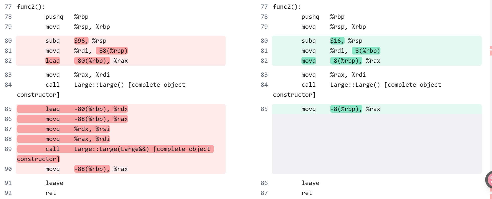

# 源代码

```c++

#include<cstdint>

struct Large {
    int64_t a = 0x1;
    int64_t b = 0x2;
    int64_t c = 0x3;
    int64_t d = 0x4;
    int64_t e = 0x5;
    int64_t f = 0x6;
    int64_t g = 0x7;
    int64_t h = 0x8;
    int64_t i = 0x9;
    int64_t j = 10;
};


Large func1() {
    Large l;
    l.j = 11;
    return l;
}

Large func2() {
    return Large{};
}

Large func3(int64_t x, int64_t y, int64_t z, Large lg) {
    lg.j = x + y + z;
    return lg;
}

Large func4(int64_t x, int64_t y, int64_t z) {
    Large lg;
    lg.j = x + y + z;
    return lg;
}


void g1() {
    int64_t x = 61;
    int64_t y = 62;
    int64_t z = 63;

    Large lg = {};

    func1();
    func2();
    func3(x, y, z, lg);
    func4(x, y, z);
}


void g2() {
    int64_t x = 61;
    int64_t y = 62;
    int64_t z = 63;

    Large lg0 = {};

    Large lg1 = func1();
    Large lg2 = func2();
    Large lg3 = func3(x, y, z, lg0);
    Large lg4 = func4(x, y, z);
}

int main() {
    g1();
    g2();
}
```


# 汇编代码(c++20)

```c++
-std=c++20 -O0 -fno-elide-constructors 
```


```c++
Large::Large(Large&&) [base object constructor]:
        pushq   %rbp
        movq    %rsp, %rbp
        pushq   %rbx
        movq    %rdi, -16(%rbp)
        movq    %rsi, -24(%rbp)
        movq    -16(%rbp), %rax
        movq    -24(%rbp), %rdx
        movq    (%rdx), %rcx
        movq    8(%rdx), %rbx
        movq    %rcx, (%rax)
        movq    %rbx, 8(%rax)
        movq    16(%rdx), %rcx
        movq    24(%rdx), %rbx
        movq    %rcx, 16(%rax)
        movq    %rbx, 24(%rax)
        movq    32(%rdx), %rcx
        movq    40(%rdx), %rbx
        movq    %rcx, 32(%rax)
        movq    %rbx, 40(%rax)
        movq    48(%rdx), %rcx
        movq    56(%rdx), %rbx
        movq    %rcx, 48(%rax)
        movq    %rbx, 56(%rax)
        movq    64(%rdx), %rcx
        movq    72(%rdx), %rbx
        movq    %rcx, 64(%rax)
        movq    %rbx, 72(%rax)
        nop
        movq    -8(%rbp), %rbx
        leave
        ret
func1():
        pushq   %rbp
        movq    %rsp, %rbp
        subq    $96, %rsp
        movq    %rdi, -88(%rbp)
        movq    $1, -80(%rbp)
        movq    $2, -72(%rbp)
        movq    $3, -64(%rbp)
        movq    $4, -56(%rbp)
        movq    $5, -48(%rbp)
        movq    $6, -40(%rbp)
        movq    $7, -32(%rbp)
        movq    $8, -24(%rbp)
        movq    $9, -16(%rbp)
        movq    $10, -8(%rbp)
        movq    $11, -8(%rbp)
        leaq    -80(%rbp), %rdx
        movq    -88(%rbp), %rax
        movq    %rdx, %rsi
        movq    %rax, %rdi
        call    Large::Large(Large&&) [complete object constructor]
        movq    -88(%rbp), %rax
        leave
        ret
func2():
        pushq   %rbp
        movq    %rsp, %rbp
        movq    %rdi, -8(%rbp)
        movq    -8(%rbp), %rax
        movq    $1, (%rax)
        movq    -8(%rbp), %rax
        movq    $2, 8(%rax)
        movq    -8(%rbp), %rax
        movq    $3, 16(%rax)
        movq    -8(%rbp), %rax
        movq    $4, 24(%rax)
        movq    -8(%rbp), %rax
        movq    $5, 32(%rax)
        movq    -8(%rbp), %rax
        movq    $6, 40(%rax)
        movq    -8(%rbp), %rax
        movq    $7, 48(%rax)
        movq    -8(%rbp), %rax
        movq    $8, 56(%rax)
        movq    -8(%rbp), %rax
        movq    $9, 64(%rax)
        movq    -8(%rbp), %rax
        movq    $10, 72(%rax)
        movq    -8(%rbp), %rax
        popq    %rbp
        ret
func3(long, long, long, Large):
        pushq   %rbp
        movq    %rsp, %rbp
        subq    $32, %rsp
        movq    %rdi, -8(%rbp)
        movq    %rsi, -16(%rbp)
        movq    %rdx, -24(%rbp)
        movq    %rcx, -32(%rbp)
        movq    -16(%rbp), %rdx
        movq    -24(%rbp), %rax
        addq    %rax, %rdx
        movq    -32(%rbp), %rax
        addq    %rdx, %rax
        movq    %rax, 88(%rbp)
        movq    -8(%rbp), %rax
        leaq    16(%rbp), %rsi
        movq    %rax, %rdi
        call    Large::Large(Large&&) [complete object constructor]
        movq    -8(%rbp), %rax
        leave
        ret
func4(long, long, long):
        pushq   %rbp
        movq    %rsp, %rbp
        subq    $112, %rsp
        movq    %rdi, -88(%rbp)
        movq    %rsi, -96(%rbp)
        movq    %rdx, -104(%rbp)
        movq    %rcx, -112(%rbp)
        movq    $1, -80(%rbp)
        movq    $2, -72(%rbp)
        movq    $3, -64(%rbp)
        movq    $4, -56(%rbp)
        movq    $5, -48(%rbp)
        movq    $6, -40(%rbp)
        movq    $7, -32(%rbp)
        movq    $8, -24(%rbp)
        movq    $9, -16(%rbp)
        movq    $10, -8(%rbp)
        movq    -96(%rbp), %rdx
        movq    -104(%rbp), %rax
        addq    %rax, %rdx
        movq    -112(%rbp), %rax
        addq    %rdx, %rax
        movq    %rax, -8(%rbp)
        leaq    -80(%rbp), %rdx
        movq    -88(%rbp), %rax
        movq    %rdx, %rsi
        movq    %rax, %rdi
        call    Large::Large(Large&&) [complete object constructor]
        movq    -88(%rbp), %rax
        leave
        ret
Large::Large(Large const&) [base object constructor]:
        pushq   %rbp
        movq    %rsp, %rbp
        pushq   %rbx
        movq    %rdi, -16(%rbp)
        movq    %rsi, -24(%rbp)
        movq    -16(%rbp), %rax
        movq    -24(%rbp), %rdx
        movq    (%rdx), %rcx
        movq    8(%rdx), %rbx
        movq    %rcx, (%rax)
        movq    %rbx, 8(%rax)
        movq    16(%rdx), %rcx
        movq    24(%rdx), %rbx
        movq    %rcx, 16(%rax)
        movq    %rbx, 24(%rax)
        movq    32(%rdx), %rcx
        movq    40(%rdx), %rbx
        movq    %rcx, 32(%rax)
        movq    %rbx, 40(%rax)
        movq    48(%rdx), %rcx
        movq    56(%rdx), %rbx
        movq    %rcx, 48(%rax)
        movq    %rbx, 56(%rax)
        movq    64(%rdx), %rcx
        movq    72(%rdx), %rbx
        movq    %rcx, 64(%rax)
        movq    %rbx, 72(%rax)
        nop
        movq    -8(%rbp), %rbx
        leave
        ret
g1():
        pushq   %rbp
        movq    %rsp, %rbp
        pushq   %rbx
        subq    $520, %rsp
        movq    $61, -24(%rbp)
        movq    $62, -32(%rbp)
        movq    $63, -40(%rbp)
        movq    $1, -528(%rbp)
        movq    $2, -520(%rbp)
        movq    $3, -512(%rbp)
        movq    $4, -504(%rbp)
        movq    $5, -496(%rbp)
        movq    $6, -488(%rbp)
        movq    $7, -480(%rbp)
        movq    $8, -472(%rbp)
        movq    $9, -464(%rbp)
        movq    $10, -456(%rbp)
        leaq    -448(%rbp), %rax
        movq    %rax, %rdi
        call    func1()
        leaq    -368(%rbp), %rax
        movq    %rax, %rdi
        call    func2()
        leaq    -528(%rbp), %rdx
        leaq    -208(%rbp), %rax
        movq    %rdx, %rsi
        movq    %rax, %rdi
        call    Large::Large(Large const&) [complete object constructor]
        leaq    -288(%rbp), %rdi
        movq    -40(%rbp), %r8
        movq    -32(%rbp), %rdx
        movq    -24(%rbp), %rsi
        subq    $80, %rsp
        movq    %rsp, %rax
        movq    -208(%rbp), %rcx
        movq    -200(%rbp), %rbx
        movq    %rcx, (%rax)
        movq    %rbx, 8(%rax)
        movq    -192(%rbp), %rcx
        movq    -184(%rbp), %rbx
        movq    %rcx, 16(%rax)
        movq    %rbx, 24(%rax)
        movq    -176(%rbp), %rcx
        movq    -168(%rbp), %rbx
        movq    %rcx, 32(%rax)
        movq    %rbx, 40(%rax)
        movq    -160(%rbp), %rcx
        movq    -152(%rbp), %rbx
        movq    %rcx, 48(%rax)
        movq    %rbx, 56(%rax)
        movq    -144(%rbp), %rcx
        movq    -136(%rbp), %rbx
        movq    %rcx, 64(%rax)
        movq    %rbx, 72(%rax)
        movq    %r8, %rcx
        call    func3(long, long, long, Large)
        addq    $80, %rsp
        leaq    -128(%rbp), %rax
        movq    -40(%rbp), %rcx
        movq    -32(%rbp), %rdx
        movq    -24(%rbp), %rsi
        movq    %rax, %rdi
        call    func4(long, long, long)
        nop
        movq    -8(%rbp), %rbx
        leave
        ret
g2():
        pushq   %rbp
        movq    %rsp, %rbp
        pushq   %rbx
        subq    $520, %rsp
        movq    $61, -24(%rbp)
        movq    $62, -32(%rbp)
        movq    $63, -40(%rbp)
        movq    $1, -208(%rbp)
        movq    $2, -200(%rbp)
        movq    $3, -192(%rbp)
        movq    $4, -184(%rbp)
        movq    $5, -176(%rbp)
        movq    $6, -168(%rbp)
        movq    $7, -160(%rbp)
        movq    $8, -152(%rbp)
        movq    $9, -144(%rbp)
        movq    $10, -136(%rbp)
        leaq    -288(%rbp), %rax
        movq    %rax, %rdi
        call    func1()
        leaq    -368(%rbp), %rax
        movq    %rax, %rdi
        call    func2()
        leaq    -208(%rbp), %rdx
        leaq    -128(%rbp), %rax
        movq    %rdx, %rsi
        movq    %rax, %rdi
        call    Large::Large(Large const&) [complete object constructor]
        leaq    -448(%rbp), %rdi
        movq    -40(%rbp), %r8
        movq    -32(%rbp), %rdx
        movq    -24(%rbp), %rsi
        subq    $80, %rsp
        movq    %rsp, %rax
        movq    -128(%rbp), %rcx
        movq    -120(%rbp), %rbx
        movq    %rcx, (%rax)
        movq    %rbx, 8(%rax)
        movq    -112(%rbp), %rcx
        movq    -104(%rbp), %rbx
        movq    %rcx, 16(%rax)
        movq    %rbx, 24(%rax)
        movq    -96(%rbp), %rcx
        movq    -88(%rbp), %rbx
        movq    %rcx, 32(%rax)
        movq    %rbx, 40(%rax)
        movq    -80(%rbp), %rcx
        movq    -72(%rbp), %rbx
        movq    %rcx, 48(%rax)
        movq    %rbx, 56(%rax)
        movq    -64(%rbp), %rcx
        movq    -56(%rbp), %rbx
        movq    %rcx, 64(%rax)
        movq    %rbx, 72(%rax)
        movq    %r8, %rcx
        call    func3(long, long, long, Large)
        addq    $80, %rsp
        leaq    -528(%rbp), %rax
        movq    -40(%rbp), %rcx
        movq    -32(%rbp), %rdx
        movq    -24(%rbp), %rsi
        movq    %rax, %rdi
        call    func4(long, long, long)
        nop
        movq    -8(%rbp), %rbx
        leave
        ret
main:
        pushq   %rbp
        movq    %rsp, %rbp
        call    g1()
        call    g2()
        movl    $0, %eax
        popq    %rbp
        ret
```


# 源代码改良

> 原来创建对象：在函数栈上分配空间再Move值
>
> 现在创建对象：在函数栈上分配空间，地址存放在%rdi，再调用构造函数

```c++
#include<cstdint>

struct Large {
    // int64_t a = 0x1;
    // int64_t b = 0x2;
    // int64_t c = 0x3;
    // int64_t d = 0x4;
    // int64_t e = 0x5;
    // int64_t f = 0x6;
    // int64_t g = 0x7;
    // int64_t h = 0x8;
    // int64_t i = 0x9;
    // int64_t j = 10;


    int64_t a;
    int64_t b;
    int64_t c;
    int64_t d;
    int64_t e;
    int64_t f;
    int64_t g;
    int64_t h;
    int64_t i;
    int64_t j;

    Large() {
        a = 0x1;
        b = 0x2;
        c = 0x3;
        d = 0x4;
        e = 0x5;
        f = 0x6;
        g = 0x7;
        h = 0x8;
        i = 0x9;
        j = 10;
    }
};


Large func1() {
    Large l;
    l.j = 11;
    return l;
}

Large func2() {
    return Large{};
}

Large func3(int64_t x, int64_t y, int64_t z, Large lg) {
    lg.j = x + y + z;
    return lg;
}

Large func4(int64_t x, int64_t y, int64_t z) {
    Large lg;
    lg.j = x + y + z;
    return lg;
}


void g1() {
    int64_t x = 61;
    int64_t y = 62;
    int64_t z = 63;

    Large lg = {};

    func1();
    func2();
    func3(x, y, z, lg);
    func4(x, y, z);
}


void g2() {
    int64_t x = 61;
    int64_t y = 62;
    int64_t z = 63;

    Large lg0 = {};

    Large lg1 = func1();
    Large lg2 = func2();
    Large lg3 = func3(x, y, z, lg0);
    Large lg4 = func4(x, y, z);
}

int main() {
    g1();
    g2();
}
```


# 汇编代码(c++20)

```c++
Large::Large() [base object constructor]:
        pushq   %rbp
        movq    %rsp, %rbp
        movq    %rdi, -8(%rbp)
        movq    -8(%rbp), %rax
        movq    $1, (%rax)
        movq    -8(%rbp), %rax
        movq    $2, 8(%rax)
        movq    -8(%rbp), %rax
        movq    $3, 16(%rax)
        movq    -8(%rbp), %rax
        movq    $4, 24(%rax)
        movq    -8(%rbp), %rax
        movq    $5, 32(%rax)
        movq    -8(%rbp), %rax
        movq    $6, 40(%rax)
        movq    -8(%rbp), %rax
        movq    $7, 48(%rax)
        movq    -8(%rbp), %rax
        movq    $8, 56(%rax)
        movq    -8(%rbp), %rax
        movq    $9, 64(%rax)
        movq    -8(%rbp), %rax
        movq    $10, 72(%rax)
        nop
        popq    %rbp
        ret
Large::Large(Large&&) [base object constructor]:
        pushq   %rbp
        movq    %rsp, %rbp
        pushq   %rbx
        movq    %rdi, -16(%rbp)
        movq    %rsi, -24(%rbp)
        movq    -16(%rbp), %rax
        movq    -24(%rbp), %rdx
        movq    (%rdx), %rcx
        movq    8(%rdx), %rbx
        movq    %rcx, (%rax)
        movq    %rbx, 8(%rax)
        movq    16(%rdx), %rcx
        movq    24(%rdx), %rbx
        movq    %rcx, 16(%rax)
        movq    %rbx, 24(%rax)
        movq    32(%rdx), %rcx
        movq    40(%rdx), %rbx
        movq    %rcx, 32(%rax)
        movq    %rbx, 40(%rax)
        movq    48(%rdx), %rcx
        movq    56(%rdx), %rbx
        movq    %rcx, 48(%rax)
        movq    %rbx, 56(%rax)
        movq    64(%rdx), %rcx
        movq    72(%rdx), %rbx
        movq    %rcx, 64(%rax)
        movq    %rbx, 72(%rax)
        nop
        movq    -8(%rbp), %rbx
        leave
        ret
func1():
        pushq   %rbp
        movq    %rsp, %rbp
        subq    $96, %rsp
        movq    %rdi, -88(%rbp)
        leaq    -80(%rbp), %rax
        movq    %rax, %rdi
        call    Large::Large() [complete object constructor]
        movq    $11, -8(%rbp)
        leaq    -80(%rbp), %rdx
        movq    -88(%rbp), %rax
        movq    %rdx, %rsi
        movq    %rax, %rdi
        call    Large::Large(Large&&) [complete object constructor]
        movq    -88(%rbp), %rax
        leave
        ret
func2():
        pushq   %rbp
        movq    %rsp, %rbp
        subq    $16, %rsp
        movq    %rdi, -8(%rbp)
        movq    -8(%rbp), %rax
        movq    %rax, %rdi
        call    Large::Large() [complete object constructor]
        movq    -8(%rbp), %rax
        leave
        ret
func3(long, long, long, Large):
        pushq   %rbp
        movq    %rsp, %rbp
        subq    $32, %rsp
        movq    %rdi, -8(%rbp)
        movq    %rsi, -16(%rbp)
        movq    %rdx, -24(%rbp)
        movq    %rcx, -32(%rbp)
        movq    -16(%rbp), %rdx
        movq    -24(%rbp), %rax
        addq    %rax, %rdx
        movq    -32(%rbp), %rax
        addq    %rdx, %rax
        movq    %rax, 88(%rbp)
        movq    -8(%rbp), %rax
        leaq    16(%rbp), %rsi
        movq    %rax, %rdi
        call    Large::Large(Large&&) [complete object constructor]
        movq    -8(%rbp), %rax
        leave
        ret
func4(long, long, long):
        pushq   %rbp
        movq    %rsp, %rbp
        subq    $112, %rsp
        movq    %rdi, -88(%rbp)
        movq    %rsi, -96(%rbp)
        movq    %rdx, -104(%rbp)
        movq    %rcx, -112(%rbp)
        leaq    -80(%rbp), %rax
        movq    %rax, %rdi
        call    Large::Large() [complete object constructor]
        movq    -96(%rbp), %rdx
        movq    -104(%rbp), %rax
        addq    %rax, %rdx
        movq    -112(%rbp), %rax
        addq    %rdx, %rax
        movq    %rax, -8(%rbp)
        leaq    -80(%rbp), %rdx
        movq    -88(%rbp), %rax
        movq    %rdx, %rsi
        movq    %rax, %rdi
        call    Large::Large(Large&&) [complete object constructor]
        movq    -88(%rbp), %rax
        leave
        ret
Large::Large(Large const&) [base object constructor]:
        pushq   %rbp
        movq    %rsp, %rbp
        pushq   %rbx
        movq    %rdi, -16(%rbp)
        movq    %rsi, -24(%rbp)
        movq    -16(%rbp), %rax
        movq    -24(%rbp), %rdx
        movq    (%rdx), %rcx
        movq    8(%rdx), %rbx
        movq    %rcx, (%rax)
        movq    %rbx, 8(%rax)
        movq    16(%rdx), %rcx
        movq    24(%rdx), %rbx
        movq    %rcx, 16(%rax)
        movq    %rbx, 24(%rax)
        movq    32(%rdx), %rcx
        movq    40(%rdx), %rbx
        movq    %rcx, 32(%rax)
        movq    %rbx, 40(%rax)
        movq    48(%rdx), %rcx
        movq    56(%rdx), %rbx
        movq    %rcx, 48(%rax)
        movq    %rbx, 56(%rax)
        movq    64(%rdx), %rcx
        movq    72(%rdx), %rbx
        movq    %rcx, 64(%rax)
        movq    %rbx, 72(%rax)
        nop
        movq    -8(%rbp), %rbx
        leave
        ret
g1():
        pushq   %rbp
        movq    %rsp, %rbp
        pushq   %rbx
        subq    $520, %rsp
        movq    $61, -24(%rbp)
        movq    $62, -32(%rbp)
        movq    $63, -40(%rbp)
        leaq    -528(%rbp), %rax
        movq    %rax, %rdi
        call    Large::Large() [complete object constructor]
        leaq    -448(%rbp), %rax
        movq    %rax, %rdi
        call    func1()
        leaq    -368(%rbp), %rax
        movq    %rax, %rdi
        call    func2()
        leaq    -528(%rbp), %rdx
        leaq    -208(%rbp), %rax
        movq    %rdx, %rsi
        movq    %rax, %rdi
        call    Large::Large(Large const&) [complete object constructor]
        leaq    -288(%rbp), %rdi
        movq    -40(%rbp), %r8
        movq    -32(%rbp), %rdx
        movq    -24(%rbp), %rsi
        subq    $80, %rsp
        movq    %rsp, %rax
        movq    -208(%rbp), %rcx
        movq    -200(%rbp), %rbx
        movq    %rcx, (%rax)
        movq    %rbx, 8(%rax)
        movq    -192(%rbp), %rcx
        movq    -184(%rbp), %rbx
        movq    %rcx, 16(%rax)
        movq    %rbx, 24(%rax)
        movq    -176(%rbp), %rcx
        movq    -168(%rbp), %rbx
        movq    %rcx, 32(%rax)
        movq    %rbx, 40(%rax)
        movq    -160(%rbp), %rcx
        movq    -152(%rbp), %rbx
        movq    %rcx, 48(%rax)
        movq    %rbx, 56(%rax)
        movq    -144(%rbp), %rcx
        movq    -136(%rbp), %rbx
        movq    %rcx, 64(%rax)
        movq    %rbx, 72(%rax)
        movq    %r8, %rcx
        call    func3(long, long, long, Large)
        addq    $80, %rsp
        leaq    -128(%rbp), %rax
        movq    -40(%rbp), %rcx
        movq    -32(%rbp), %rdx
        movq    -24(%rbp), %rsi
        movq    %rax, %rdi
        call    func4(long, long, long)
        nop
        movq    -8(%rbp), %rbx
        leave
        ret
g2():
        pushq   %rbp
        movq    %rsp, %rbp
        pushq   %rbx
        subq    $520, %rsp
        movq    $61, -24(%rbp)
        movq    $62, -32(%rbp)
        movq    $63, -40(%rbp)
        leaq    -208(%rbp), %rax
        movq    %rax, %rdi
        call    Large::Large() [complete object constructor]
        leaq    -288(%rbp), %rax
        movq    %rax, %rdi
        call    func1()
        leaq    -368(%rbp), %rax
        movq    %rax, %rdi
        call    func2()
        leaq    -208(%rbp), %rdx
        leaq    -128(%rbp), %rax
        movq    %rdx, %rsi
        movq    %rax, %rdi
        call    Large::Large(Large const&) [complete object constructor]
        leaq    -448(%rbp), %rdi
        movq    -40(%rbp), %r8
        movq    -32(%rbp), %rdx
        movq    -24(%rbp), %rsi
        subq    $80, %rsp
        movq    %rsp, %rax
        movq    -128(%rbp), %rcx
        movq    -120(%rbp), %rbx
        movq    %rcx, (%rax)
        movq    %rbx, 8(%rax)
        movq    -112(%rbp), %rcx
        movq    -104(%rbp), %rbx
        movq    %rcx, 16(%rax)
        movq    %rbx, 24(%rax)
        movq    -96(%rbp), %rcx
        movq    -88(%rbp), %rbx
        movq    %rcx, 32(%rax)
        movq    %rbx, 40(%rax)
        movq    -80(%rbp), %rcx
        movq    -72(%rbp), %rbx
        movq    %rcx, 48(%rax)
        movq    %rbx, 56(%rax)
        movq    -64(%rbp), %rcx
        movq    -56(%rbp), %rbx
        movq    %rcx, 64(%rax)
        movq    %rbx, 72(%rax)
        movq    %r8, %rcx
        call    func3(long, long, long, Large)
        addq    $80, %rsp
        leaq    -528(%rbp), %rax
        movq    -40(%rbp), %rcx
        movq    -32(%rbp), %rdx
        movq    -24(%rbp), %rsi
        movq    %rax, %rdi
        call    func4(long, long, long)
        nop
        movq    -8(%rbp), %rbx
        leave
        ret
main:
        pushq   %rbp
        movq    %rsp, %rbp
        call    g1()
        call    g2()
        movl    $0, %eax
        popq    %rbp
        ret
```


# 汇编代码(c++11)

```c++

```


# C++11和C++20差异

## func2

```c++
Large func2() {
    return Large{};
}
```




## g2

```c++
void g2() {
    int64_t x = 61;
    int64_t y = 62;
    int64_t z = 63;

    Large lg0 = {};

    Large lg1 = func1();
    Large lg2 = func2();
    Large lg3 = func3(x, y, z, lg0);
    Large lg4 = func4(x, y, z);
}
```

gcc C++11为函数的返回值分配了栈上临时空间，然后通过Large(Large&&) move

gcc C++20中函数的返回值空间和局部变量空间是一个位置