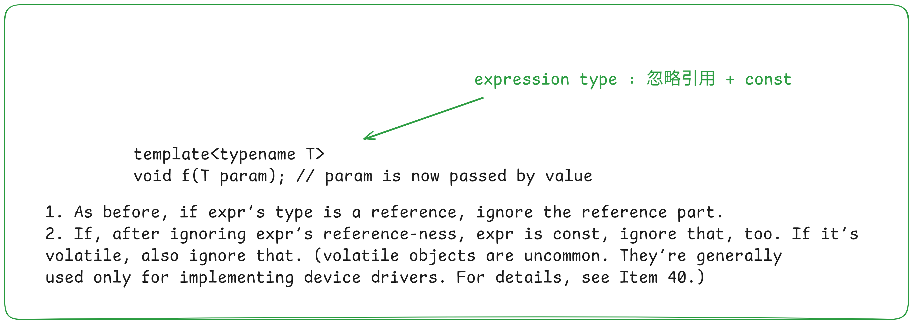
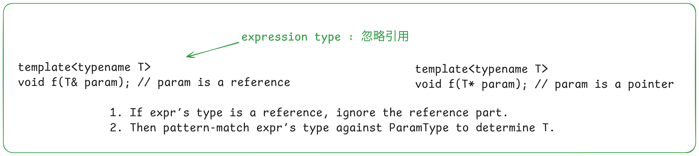
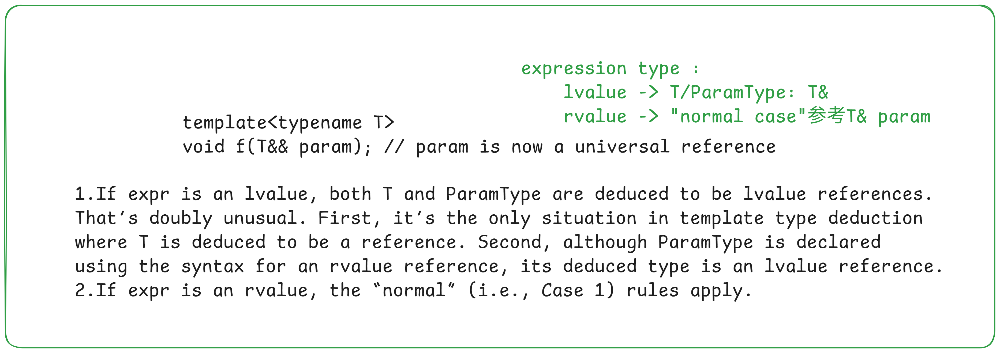

```c++
template <typename T>
void func(ParameterType param);

func(expression);
```

# 1. 值传递



```c++
template<typename T>
void func(T param) {
    //......
}

func(expr);
```

1. When `expr` is a reference, the reference is ignored `=> newExpr `is created
2. When `newExpr` is `const` or `volatile`, `const` or `volatile` is ignored.

# 2. 引用传递



```c++
template<typename T>
void func(T& param) {
    //......
}

func(expr);
```

1. When `expr` is a reference, the reference is ignored (but added at the end).
2. The expr matches the `ParameterType` and the resulting type becomes a reference. This means,
   - an `expr` of type `int` becomes an` int&`
   - an `expr` of type` const int` becomes a `const int&`
   - an `expr` of type` const int&` becomes a `const int&`

# 3. universal reference



```c++
template<typename T>
void func(T&& param) {
    //......
}

func(expr);
```

1. When `expr` is an lvalue, the resulting type becomes an lvalue reference.
2. When `expr` is an rvalue, the resulting type becomes an rvalue reference.


# 4. Decay

直觉：如果模板类似这样：`template<typename T> void func(T args);`，那么传递数组、函数时会发生退化（退化为指针）。还有其他。。。。。。

