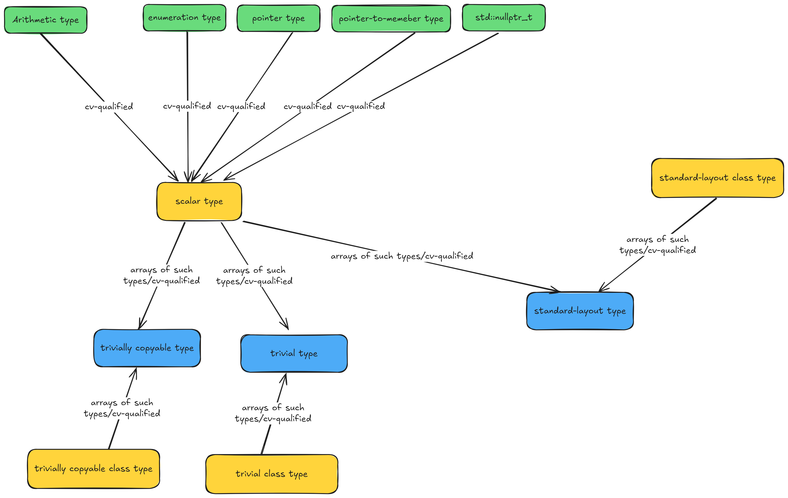

# 

# 1. fundamental types

1. the type void

2. the type [std::nullptr_t](https://en.cppreference.com/w/cpp/types/nullptr_t)

3. arithmetic types:

   1. integral types
   2. floating-point types

   

# 2. compound types

   1. [reference types](https://en.cppreference.com/w/cpp/language/reference):

      - [lvalue reference types](https://en.cppreference.com/w/cpp/language/reference#Lvalue_references):
        - lvalue reference to object types;
        - lvalue reference to function types;
      - [rvalue reference types](https://en.cppreference.com/w/cpp/language/reference#Rvalue_references):
        - rvalue reference to object types;
        - rvalue reference to function types;

4. [pointer types](https://en.cppreference.com/w/cpp/language/pointer#Pointers):

   1. [pointer-to-object types](https://en.cppreference.com/w/cpp/language/pointer#Pointers_to_objects);
   2. [pointer-to-function types](https://en.cppreference.com/w/cpp/language/pointer#Pointers_to_functions);

5. [pointer-to-member types](https://en.cppreference.com/w/cpp/language/pointer#Pointers_to_members):

   1. [pointer-to-data-member](https://en.cppreference.com/w/cpp/language/pointer#Pointers_to_data_members) types;

   2. [pointer-to-member-function](https://en.cppreference.com/w/cpp/language/pointer#Pointers_to_member_functions) types;

6. [array types](https://en.cppreference.com/w/cpp/language/array);

7. [function types](https://en.cppreference.com/w/cpp/language/function);

8. [enumeration types](https://en.cppreference.com/w/cpp/language/enum);

   1. [unscoped enumeration types](https://en.cppreference.com/w/cpp/language/enum#Unscoped_enumerations);

   2. [scoped enumeration types](https://en.cppreference.com/w/cpp/language/enum#Scoped_enumerations);

9. [class types](https://en.cppreference.com/w/cpp/language/class):

   1. non-union types;

   2. [union types](https://en.cppreference.com/w/cpp/language/union).


# 3. Trival, Standard Layout 

==The term *layout* refers to how the members of an object of class, struct or union type are arranged in memory.== In some cases, the layout is well-defined by the language specification. But <u>when a class or struct contains certain C++ language features such as virtual base classes, virtual functions, members with different access control, then the compiler is free to choose a layout.</u> That layout may vary depending on what optimizations are being performed and in many cases the object might not even occupy a contiguous area of memory. For example, if a class has virtual functions, all the instances of that class might share a single virtual function table. Such types are very useful, but they also have limitations. Because the layout is undefined they cannot be passed to programs written in other languages, such as C, and because they might be non-contiguous they cannot be reliably copied with fast low-level functions such as `memcopy`, or serialized over a network.

To enable compilers as well as C++ programs and metaprograms to reason about the suitability of any given type for operations that depend on a particular memory layout, C++14 introduced three categories of simple classes and structs: *trivial*, *standard-layout*, and *POD* or Plain Old Data. The Standard Library has the function templates `is_trivial<T>`, `is_standard_layout<T>` and `is_pod<T>` that determine whether a given type belongs to a given category.


## Trivial types

> When a class or struct in C++ has compiler-provided or explicitly defaulted special member functions, then it is a trivial type. 

特点：

1. It occupies a contiguous memory area. 
2. It can have members with different access specifiers.
3. In C++, the compiler is free to choose how to order members in this situation. 

Therefore, <u>you can memcopy such objects but you cannot reliably consume them from a C program.</u> A trivial type T can be copied into an array of char or unsigned char, and safely copied back into a T variable. Note that because of alignment requirements, there might be padding bytes between type members.

Trivial types have a trivial default constructor, trivial copy constructor, trivial copy assignment operator and trivial destructor. 

> 正式定义：

In each case, *trivial* means the constructor/operator/destructor is not user-provided and belongs to a class that has

- no virtual functions or virtual base classes,
- no base classes with a corresponding non-trivial constructor/operator/destructor
- no data members of class type with a corresponding non-trivial constructor/operator/destructor

------

The following examples show trivial types. In Trivial2, the presence of the `Trivial2(int a, int b)` constructor requires that you provide a default constructor. For the type to qualify as trivial, you must explicitly default that constructor.

C++

```cpp
struct Trivial
{
   int i;
private:
   int j;
};

struct Trivial2
{
   int i;
   Trivial2(int a, int b) : i(a), j(b) {}
   Trivial2() = default;
private:
   int j;   // Different access control
};
```


## Standard layout types

> When a class or struct does not contain certain C++ language features such as virtual functions which are not found in the C language, and all members have the same access control, it is a standard-layout type. 

特点：

1. It is memcopy-able and the layout is sufficiently defined that it can be consumed by C programs. 
2. Standard-layout types can have user-defined special member functions. 

> 正式定义：

In addition, standard layout types have these characteristics:

- no virtual functions or virtual base classes
- all non-static data members have the same access control
- all non-static members of class type are standard-layout
- any base classes are standard-layout
- has no base classes of the same type as the first non-static data member.
- meets one of these conditions:
  - no non-static data member in the most-derived class and no more than one base class with non-static data members, or
  - has no base classes with non-static data members

------

The following code shows one example of a standard-layout type:

C++

```cpp
struct SL
{
   // All members have same access:
   int i;
   int j;
   SL(int a, int b) : i(a), j(b) {} // User-defined constructor OK
};
```

The last two requirements can perhaps be better illustrated with code. In the next example, even though Base is standard-layout, `Derived` is not standard layout because both it (the most derived class) and `Base` have non-static data members:

C++

```cpp
struct Base
{
   int i;
   int j;
};

// std::is_standard_layout<Derived> == false!
struct Derived : public Base
{
   int x;
   int y;
};
```

In this example `Derived` is standard-layout because `Base` has no non-static data members:

C++

```cpp
struct Base
{
   void Foo() {}
};

// std::is_standard_layout<Derived> == true
struct Derived : public Base
{
   int x;
   int y;
};
```

Derived would also be standard-layout if `Base` had the data members and `Derived` had only member functions.


## POD types

When a class or struct is both trivial and standard-layout, it is a POD (Plain Old Data) type. The memory layout of POD types is therefore contiguous and each member has a higher address than the member that was declared before it, so that byte for byte copies and binary I/O can be performed on these types. Scalar types such as int are also POD types. POD types that are classes can have only POD types as non-static data members.


# 4. 图解(部分类型)


