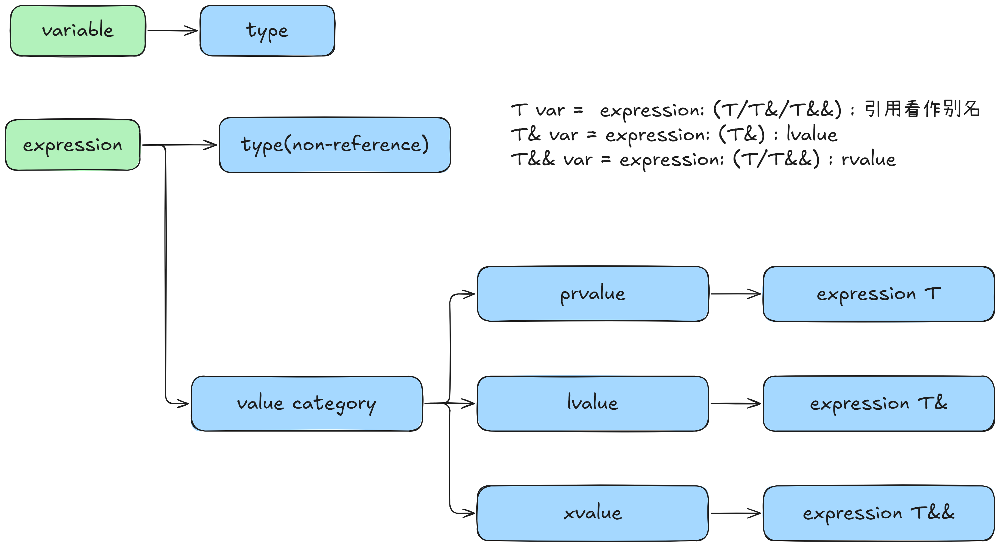
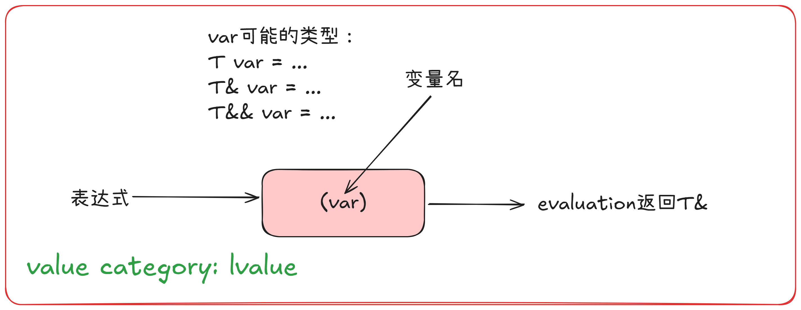
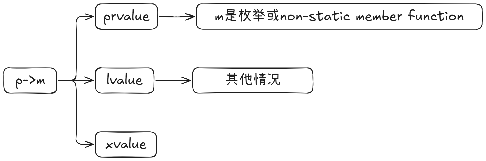

# 1.图解









# 2.prvalue

- **是什么？** "prvalue" 代表 "pure rvalue" (纯右值)。**prvalue 是一个表达式，它的评估结果要么是初始化一个对象，要么是计算某个运算符的操作数的值。它本身不与特定的内存位置关联，除非它被物化 (materialized)。** 可以把它想象成一个“纯粹的值”，比如数字 42。
- **关键特征：**
  - **没有身份：** 你不能直接多次引用同一个 prvalue (除非它被物化成一个临时对象)。
  - **不能直接获取地址：** 你不能对一个 prvalue (在它被物化之前) 使用 & 操作符。
  - **不能被赋值：** prvalue 通常不能出现在赋值操作符的左边。
  - **通常是临时的：** 它们经常代表表达式计算的中间结果。
- **常见例子：**
  - 字面量 (除了字符串字面量)：42, 3.14, true, nullptr。
  - 返回非引用类型的函数调用：int get_val() { return 100; } get_val(); (get_val() 的结果是 prvalue)
  - 算术、逻辑、比较、位运算等操作的结果：a + b, x && y, i < 10 (如果 a, b, x, y, i 本身不是复杂类型导致重载操作符返回引用的情况)。
  - this 指针 (在非静态成员函数内部，this 本身是一个 prvalue，其值是当前对象的地址)。
  - Lambda 表达式本身 (例如 [](){}) 是一个 prvalue。
  - 大多数类型转换的结果，例如 (int)d 或 static_cast<int>(d) (如果转换为非引用类型)。


# 3.xvalue

- **是什么？** "xvalue" 代表 "eXpiring value" (将亡值)。**xvalue 是一个表示其资源可以被“窃取”(移动) 的对象的表达式。它也指向一个内存位置，但这个对象通常接近其生命周期的末尾，或者被显式标记为可移动。**

- **关键特征：**

  - **有身份：** 和 lvalue 一样，xvalue 指向一个特定的对象。
  - **可以获取地址：** (虽然不常见，但技术上可以，因为它是已物化的对象)。
  - **不能被赋值：** 通常不能出现在赋值操作符的左边。
  - **资源可重用：** 这是 xvalue 的核心特性。它们是移动语义的关键。

- **常见来源：**

  - **std::move 的结果：** std::move(some_lvalue) 将一个 lvalue 转换为 xvalue，表明其资源可以被移动。

    ```
    std::string s1 = "hello";
    std::string s2 = std::move(s1); // std::move(s1) 是一个 xvalue
                                    // s1 的状态现在是有效的但未指定的
    ```

    content_copydownload

    Use code [with caution](https://support.google.com/legal/answer/13505487).C++

  - **返回右值引用的函数调用：** T&& func() { /* ... */ return std::move(obj_T); } func(); (func() 的结果是 xvalue)。

  - **临时对象物化 (Temporary Materialization) 的结果：** 当一个 prvalue 需要一个实际的对象实例时 (例如，绑定到右值引用，或对其进行成员访问)，它会物化成一个临时对象，这个临时对象就是 xvalue。

    ```
    struct MyData { int val = 0; void process() {} };
    MyData().process(); // MyData() 是 prvalue, 为了调用 process(),
                       // 它物化成一个 xvalue 临时对象。
    MyData&& ref = MyData(); // MyData() 是 prvalue, 物化成 xvalue 临时对象,
                           // 然后被 ref (右值引用) 绑定。
    ```

    content_copydownload

    Use code [with caution](https://support.google.com/legal/answer/13505487).C++

  - **转换为右值引用的类型转换：** static_cast<T&&>(some_lvalue) 的结果。

  - **类成员访问表达式，其中对象表达式是右值，并且成员是非引用类型的非静态数据成员：** MyData().val (如果 MyData() 是右值，val 是 int)。

# 4.lvalue

- **是什么？** "lvalue" 最初代表 "left-hand side of an assignment" (赋值操作的左侧)。更准确地说，**lvalue 是一个表示了“位置”(locator value) 的表达式，它指向一个可识别的内存位置 (对象或函数)。**
- **关键特征：**
  - **有身份 (Identity)：** 你可以多次引用同一个 lvalue，并且它指的是同一个对象。
  - **可以获取地址：** 通常你可以对 lvalue 使用取地址操作符 & 来获取其内存地址。
  - **可以被赋值：** 非 const 的 lvalue 通常可以出现在赋值操作符的左边。
- **常见例子：**
  - 变量名：int x; x = 10; (x 是 lvalue)
  - 解引用的指针：int* p = &x; *p = 20; (*p 是 lvalue)
  - 数组元素：int arr[5]; arr[0] = 5; (arr[0] 是 lvalue)
  - 返回左值引用的函数调用：int& get_ref() { static int val = 0; return val; } get_ref() = 30; (get_ref() 的结果是 lvalue)
  - 字符串字面量："hello" (它是一个 const char[6] 类型的 lvalue)
  - 成员访问 (如果对象是 lvalue 且成员不是非静态成员函数或枚举器)：struct S { int m; }; S s; s.m = 1; (s.m 是 lvalue)


# 5.**Materialization (物化)** 

在 C++ 中，**Materialization (物化)** 是一个非常重要的概念，它描述了**纯右值 (prvalue) 如何以及何时被转换成一个具体的、拥有内存地址的临时对象 (temporary object)，这个临时对象是一个将亡值 (xvalue)**。

理解 Materialization 的关键在于理解 C++ 的值类别 (value categories)，特别是纯右值 (prvalue)。

### 值类别回顾 (简要)

*   **lvalue (左值)**: 表示一个可识别的内存位置的对象或函数。你可以获取其地址。例如：变量名、解引用的指针。
*   **prvalue (纯右值)**: 通常是表达式的计算结果，它不与任何特定的内存位置关联，除非它被物化。例如：字面量 (`42`, `"hello"`), 函数返回非引用类型的值 (`get_int()`), 算术表达式的结果 (`a + b`)。
*   **xvalue (将亡值)**: 表示一个其资源可以被重用的对象，通常是即将销毁的临时对象或被 `std::move` 转换后的对象。xvalue 也是有内存地址的。

**核心点**：prvalue 本身没有身份（identity），没有固定的内存地址。Materialization 就是给这个 "纯粹的值" 一个临时的 "身体"（内存）。

### 什么是 Materialization (物化)？

> A prvalue of type T can be converted to an xvalue of type T. This conversion initializes a temporary object (6.7.7) of type T from the prvalue by evaluating the prvalue with the temporary object as its result object, and produces an xvalue denoting the temporary object. T shall be a complete type.

Materialization 是一个过程，在这个过程中，一个 prvalue 表达式会被用来初始化一个临时对象。这个新创建的临时对象是一个 xvalue。一旦物化发生，这个临时对象就拥有了确定的存储期和内存地址。

这个过程的正式名称是 "temporary materialization conversion" (临时对象物化转换)。

### Materialization 何时发生？

C++ 标准规定了 prvalue 会在特定上下文中被物化：

The materialization of a temporary object is generally delayed as long as possible in order to avoid creating unnecessary temporary objects. 

> Note that temporary materialization does **not** occur when initializing an object from a prvalue of the same type (by [direct-initialization](https://en.cppreference.com/w/cpp/language/direct_initialization) or [copy-initialization](https://en.cppreference.com/w/cpp/language/copy_initialization)): such object is initialized directly from the initializer. This ensures “guaranteed copy elision”.

note 3 Temporary objects are materialized:

1. when binding a reference to a prvalue (9.4.4, 7.6.1.4, 7.6.1.7, 7.6.1.9, 7.6.1.11, 7.6.3),
2. when performing member access on a class prvalue (7.6.1.5, 7.6.4), 
3. when performing an array-to-pointer conversion or subscripting on an array prvalue (7.3.3, 7.6.1.2),
4. when initializing an object of type std::initializer_list from a braced-init-list (9.4.5),
5. for certain unevaluated operands (7.6.1.8, 7.6.2.5), and 
6. when a prvalue that has type other than cv void appears as a discarded-value expression (7.2.3).

   - **示例：**

     ```c++
     struct Logger {
         Logger() { /* ... */ }
         ~Logger() { /* 析构时记录一些东西 */ }
     };
     Logger getLogger() { return Logger(); }
     
     getLogger(); // getLogger() 返回的 Logger 对象是一个纯右值。
                  // 它没有赋给任何东西。
                  // 它必须被物化，以便其析构函数能够运行。
     
     int getInt() { return 42; }
     getInt();    // int 纯右值 (42) 被物化然后被丢弃。
                  // 对于内置类型，这通常除了计算本身外没有可见效果。
     ```

   - **原因：** 如果一个表达式产生一个值（一个非 void 类型的纯右值），而这个值没有被使用（它本身就是一个独立的语句），那么它就是一个“discarded-value expression”。

     - 对于具有非平凡析构函数的类类型（如 Logger），该对象*必须*被物化，以便在临时对象超出作用域时（在完整表达式结束时）可以调用其析构函数。这确保了诸如日志记录、资源释放等副作用的发生。
     - 对于在析构时没有副作用的类型（如 int），纯右值仍然会被物化，然后立即销毁（对 int 而言这是无操作）。但表达式仍然需要被求值。


### 为什么 Materialization 很重要？

1.  **生命周期延长 (Lifetime Extension)**: 这是最常见的与物化相关的益处。当一个 prvalue 物化产生的临时对象被绑定到一个引用时，该临时对象的生命周期通常会延长到引用的生命周期。这使得我们可以安全地使用通过函数返回的临时对象。
2.  **允许操作**: prvalue 本身是“幽灵般”的，没有实际的内存。为了对它进行一些需要对象实例的操作（如调用成员函数、访问成员变量、获取其地址(虽然不直接对 prvalue 做，但对物化后的 xvalue 可以)），它必须首先被物化成一个真正的（临时）对象。
3.  **理解 RVO/NRVO**: RVO 和 NRVO 是避免不必要的拷贝和移动的强大优化。它们通过直接在最终目标内存位置构造对象来工作，从而*跳过了* prvalue 的物化以及后续的拷贝/移动。当 RVO/NRVO 不适用时，才会发生物化（如果需要）和拷贝/移动。
4.  **清晰的值语义**: 它明确了纯粹的值何时以及如何获得一个临时的“存在”。

### 总结

*   **Materialization (物化)** 是指 C++ 编译器将一个 **prvalue (纯右值)** 转换成一个 **xvalue (将亡值)** 的过程，这个 xvalue 指向一个新创建的、拥有实际内存的 **临时对象 (temporary object)**。
*   物化发生在特定情况下，最常见的是当 prvalue 需要被绑定到引用，或者当需要对一个类类型的 prvalue 进行成员访问时。
*   物化的一个关键结果是临时对象的生命周期延长机制（当绑定到引用时）。
*   理解物化有助于更好地理解 C++ 的值类别、对象生命周期、右值引用以及 RVO/NRVO 等优化。

可以将 prvalue 想象成一个菜谱（描述了如何做出菜肴），而物化就是按照这个菜谱实际做出一道菜（临时对象），这道菜可以被端给某人（绑定到引用），或者被用来做其他事情（成员访问）。


# 66. 关键字


## 1.2 std::move

直觉：把表达式的值类别变为rvalue reference, 标记表达式可以被移动


## 1.3 std::forward

直觉：配合universal reference使用

```c++
template<typename T>
void func(T&& args) {
	std::forward<T>(args);
}
```

> 插曲：
>
> ```c++
> 变量类型：
>  int a;
> 	int& la;
> 	int&& ra;
> 
> 	const int ca;
> 	const int& cla;
> 	const int&& cra;
> 
> Note:所有的变量用作表达式时，值类别都是lvalue
> ```
>
> void func(const Type&); //可以接受任何类型表达式
>
> void func(Type&&); //可以接受non-const rvalue表达式
>
> void func(Type&); //可以接受non-const lvalue表达式


#  