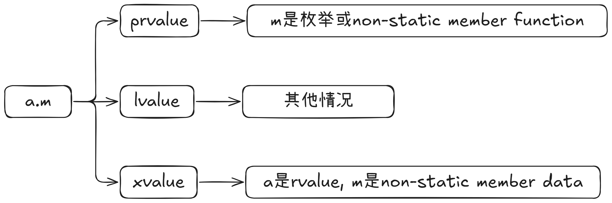

# 1.图解





# 2.prvalue

- **是什么？** "prvalue" 代表 "pure rvalue" (纯右值)。**prvalue 是一个表达式，它的评估结果要么是初始化一个对象，要么是计算某个运算符的操作数的值。它本身不与特定的内存位置关联，除非它被物化 (materialized)。** 可以把它想象成一个“纯粹的值”，比如数字 42。
- **关键特征：**
  - **没有身份：** 你不能直接多次引用同一个 prvalue (除非它被物化成一个临时对象)。
  - **不能直接获取地址：** 你不能对一个 prvalue (在它被物化之前) 使用 & 操作符。
  - **不能被赋值：** prvalue 通常不能出现在赋值操作符的左边。
  - **通常是临时的：** 它们经常代表表达式计算的中间结果。
- **常见例子：**
  - 字面量 (除了字符串字面量)：42, 3.14, true, nullptr。
  - 返回非引用类型的函数调用：int get_val() { return 100; } get_val(); (get_val() 的结果是 prvalue)
  - 算术、逻辑、比较、位运算等操作的结果：a + b, x && y, i < 10 (如果 a, b, x, y, i 本身不是复杂类型导致重载操作符返回引用的情况)。
  - this 指针 (在非静态成员函数内部，this 本身是一个 prvalue，其值是当前对象的地址)。
  - Lambda 表达式本身 (例如 [](){}) 是一个 prvalue。
  - 大多数类型转换的结果，例如 (int)d 或 static_cast<int>(d) (如果转换为非引用类型)。


# 3.xvalue

- **是什么？** "xvalue" 代表 "eXpiring value" (将亡值)。**xvalue 是一个表示其资源可以被“窃取”(移动) 的对象的表达式。它也指向一个内存位置，但这个对象通常接近其生命周期的末尾，或者被显式标记为可移动。**

- **关键特征：**

  - **有身份：** 和 lvalue 一样，xvalue 指向一个特定的对象。
  - **可以获取地址：** (虽然不常见，但技术上可以，因为它是已物化的对象)。
  - **不能被赋值：** 通常不能出现在赋值操作符的左边。
  - **资源可重用：** 这是 xvalue 的核心特性。它们是移动语义的关键。

- **常见来源：**

  - **std::move 的结果：** std::move(some_lvalue) 将一个 lvalue 转换为 xvalue，表明其资源可以被移动。

    ```
    std::string s1 = "hello";
    std::string s2 = std::move(s1); // std::move(s1) 是一个 xvalue
                                    // s1 的状态现在是有效的但未指定的
    ```

    content_copydownload

    Use code [with caution](https://support.google.com/legal/answer/13505487).C++

  - **返回右值引用的函数调用：** T&& func() { /* ... */ return std::move(obj_T); } func(); (func() 的结果是 xvalue)。

  - **临时对象物化 (Temporary Materialization) 的结果：** 当一个 prvalue 需要一个实际的对象实例时 (例如，绑定到右值引用，或对其进行成员访问)，它会物化成一个临时对象，这个临时对象就是 xvalue。

    ```
    struct MyData { int val = 0; void process() {} };
    MyData().process(); // MyData() 是 prvalue, 为了调用 process(),
                       // 它物化成一个 xvalue 临时对象。
    MyData&& ref = MyData(); // MyData() 是 prvalue, 物化成 xvalue 临时对象,
                           // 然后被 ref (右值引用) 绑定。
    ```

    content_copydownload

    Use code [with caution](https://support.google.com/legal/answer/13505487).C++

  - **转换为右值引用的类型转换：** static_cast<T&&>(some_lvalue) 的结果。

  - **类成员访问表达式，其中对象表达式是右值，并且成员是非引用类型的非静态数据成员：** MyData().val (如果 MyData() 是右值，val 是 int)。

# 4.lvalue

- **是什么？** "lvalue" 最初代表 "left-hand side of an assignment" (赋值操作的左侧)。更准确地说，**lvalue 是一个表示了“位置”(locator value) 的表达式，它指向一个可识别的内存位置 (对象或函数)。**
- **关键特征：**
  - **有身份 (Identity)：** 你可以多次引用同一个 lvalue，并且它指的是同一个对象。
  - **可以获取地址：** 通常你可以对 lvalue 使用取地址操作符 & 来获取其内存地址。
  - **可以被赋值：** 非 const 的 lvalue 通常可以出现在赋值操作符的左边。
- **常见例子：**
  - 变量名：int x; x = 10; (x 是 lvalue)
  - 解引用的指针：int* p = &x; *p = 20; (*p 是 lvalue)
  - 数组元素：int arr[5]; arr[0] = 5; (arr[0] 是 lvalue)
  - 返回左值引用的函数调用：int& get_ref() { static int val = 0; return val; } get_ref() = 30; (get_ref() 的结果是 lvalue)
  - 字符串字面量："hello" (它是一个 const char[6] 类型的 lvalue)
  - 成员访问 (如果对象是 lvalue 且成员不是非静态成员函数或枚举器)：struct S { int m; }; S s; s.m = 1; (s.m 是 lvalue)


# 5.**Materialization (物化)** 

在 C++ 中，**Materialization (物化)** 是一个非常重要的概念，它描述了**纯右值 (prvalue) 如何以及何时被转换成一个具体的、拥有内存地址的临时对象 (temporary object)，这个临时对象是一个将亡值 (xvalue)**。

理解 Materialization 的关键在于理解 C++ 的值类别 (value categories)，特别是纯右值 (prvalue)。

### 值类别回顾 (简要)

*   **lvalue (左值)**: 表示一个可识别的内存位置的对象或函数。你可以获取其地址。例如：变量名、解引用的指针。
*   **prvalue (纯右值)**: 通常是表达式的计算结果，它不与任何特定的内存位置关联，除非它被物化。例如：字面量 (`42`, `"hello"`), 函数返回非引用类型的值 (`get_int()`), 算术表达式的结果 (`a + b`)。
*   **xvalue (将亡值)**: 表示一个其资源可以被重用的对象，通常是即将销毁的临时对象或被 `std::move` 转换后的对象。xvalue 也是有内存地址的。

**核心点**：prvalue 本身没有身份（identity），没有固定的内存地址。Materialization 就是给这个 "纯粹的值" 一个临时的 "身体"（内存）。

### 什么是 Materialization (物化)？

> A prvalue of type T can be converted to an xvalue of type T. This conversion initializes a temporary object (6.7.7) of type T from the prvalue by evaluating the prvalue with the temporary object as its result object, and produces an xvalue denoting the temporary object. T shall be a complete type.

Materialization 是一个过程，在这个过程中，一个 prvalue 表达式会被用来初始化一个临时对象。这个新创建的临时对象是一个 xvalue。一旦物化发生，这个临时对象就拥有了确定的存储期和内存地址。

这个过程的正式名称是 "temporary materialization conversion" (临时对象物化转换)。

### Materialization 何时发生？

C++ 标准规定了 prvalue 会在特定上下文中被物化：

The materialization of a temporary object is generally delayed as long as possible in order to avoid creating unnecessary temporary objects. 

> Note that temporary materialization does **not** occur when initializing an object from a prvalue of the same type (by [direct-initialization](https://en.cppreference.com/w/cpp/language/direct_initialization) or [copy-initialization](https://en.cppreference.com/w/cpp/language/copy_initialization)): such object is initialized directly from the initializer. This ensures “guaranteed copy elision”.

note 3 Temporary objects are materialized:

1. when binding a reference to a prvalue (9.4.4, 7.6.1.4, 7.6.1.7, 7.6.1.9, 7.6.1.11, 7.6.3),
2. when performing member access on a class prvalue (7.6.1.5, 7.6.4), 
3. when performing an array-to-pointer conversion or subscripting on an array prvalue (7.3.3, 7.6.1.2),
4. when initializing an object of type std::initializer_list from a braced-init-list (9.4.5),
5. for certain unevaluated operands (7.6.1.8, 7.6.2.5), and 
6. when a prvalue that has type other than cv void appears as a discarded-value expression (7.2.3).

   - **示例：**

     ```c++
     struct Logger {
         Logger() { /* ... */ }
         ~Logger() { /* 析构时记录一些东西 */ }
     };
     Logger getLogger() { return Logger(); }
     
     getLogger(); // getLogger() 返回的 Logger 对象是一个纯右值。
                  // 它没有赋给任何东西。
                  // 它必须被物化，以便其析构函数能够运行。
     
     int getInt() { return 42; }
     getInt();    // int 纯右值 (42) 被物化然后被丢弃。
                  // 对于内置类型，这通常除了计算本身外没有可见效果。
     ```

   - **原因：** 如果一个表达式产生一个值（一个非 void 类型的纯右值），而这个值没有被使用（它本身就是一个独立的语句），那么它就是一个“discarded-value expression”。

     - 对于具有非平凡析构函数的类类型（如 Logger），该对象*必须*被物化，以便在临时对象超出作用域时（在完整表达式结束时）可以调用其析构函数。这确保了诸如日志记录、资源释放等副作用的发生。
     - 对于在析构时没有副作用的类型（如 int），纯右值仍然会被物化，然后立即销毁（对 int 而言这是无操作）。但表达式仍然需要被求值。


### 为什么 Materialization 很重要？

1.  **生命周期延长 (Lifetime Extension)**: 这是最常见的与物化相关的益处。当一个 prvalue 物化产生的临时对象被绑定到一个引用时，该临时对象的生命周期通常会延长到引用的生命周期。这使得我们可以安全地使用通过函数返回的临时对象。
2.  **允许操作**: prvalue 本身是“幽灵般”的，没有实际的内存。为了对它进行一些需要对象实例的操作（如调用成员函数、访问成员变量、获取其地址(虽然不直接对 prvalue 做，但对物化后的 xvalue 可以)），它必须首先被物化成一个真正的（临时）对象。
3.  **理解 RVO/NRVO**: RVO 和 NRVO 是避免不必要的拷贝和移动的强大优化。它们通过直接在最终目标内存位置构造对象来工作，从而*跳过了* prvalue 的物化以及后续的拷贝/移动。当 RVO/NRVO 不适用时，才会发生物化（如果需要）和拷贝/移动。
4.  **清晰的值语义**: 它明确了纯粹的值何时以及如何获得一个临时的“存在”。

### 总结

*   **Materialization (物化)** 是指 C++ 编译器将一个 **prvalue (纯右值)** 转换成一个 **xvalue (将亡值)** 的过程，这个 xvalue 指向一个新创建的、拥有实际内存的 **临时对象 (temporary object)**。
*   物化发生在特定情况下，最常见的是当 prvalue 需要被绑定到引用，或者当需要对一个类类型的 prvalue 进行成员访问时。
*   物化的一个关键结果是临时对象的生命周期延长机制（当绑定到引用时）。
*   理解物化有助于更好地理解 C++ 的值类别、对象生命周期、右值引用以及 RVO/NRVO 等优化。

可以将 prvalue 想象成一个菜谱（描述了如何做出菜肴），而物化就是按照这个菜谱实际做出一道菜（临时对象），这道菜可以被端给某人（绑定到引用），或者被用来做其他事情（成员访问）。


# 6. 重要用法


## 1.std::move

好的，我们来详细理解一下 C++ 中的 `std::move`，从它的动机开始。

### 理解 C++ 中的 `std::move`

`std::move` 是 C++11 引入的一个重要特性，它与右值引用和移动语义紧密相关。理解 `std::move` 的关键在于理解它试图解决的问题。

### 1. 动机 (Motivation)：昂贵的拷贝

在 C++11 之前，对象的传递（例如函数参数传递、函数返回值、对象赋值）通常涉及**拷贝**操作。

*   **拷贝构造函数**：`MyClass obj2 = obj1;` 或 `MyClass obj2(obj1);`
*   **拷贝赋值运算符**：`obj2 = obj1;`

对于一些简单的对象（如 `int`、`double`），拷贝的开销很小。但对于拥有动态分配资源（如堆内存、文件句柄、网络连接等）的复杂对象（如 `std::string`, `std::vector`, `std::unique_ptr`），拷贝操作可能非常昂贵：

1.  **资源重新分配**：需要为新对象分配新的内存。
2.  **数据复制**：需要将原对象的数据逐一复制到新分配的内存中。

**问题场景示例：**

```cpp
std::vector<int> create_large_vector() {
    std::vector<int> temp_vec;
    // 假设 temp_vec 被填充了大量数据
    for (int i = 0; i < 1000000; ++i) {
        temp_vec.push_back(i);
    }
    return temp_vec; // <--- 问题点1：temp_vec 将被拷贝
}

int main() {
    std::vector<int> my_vec;
    my_vec = create_large_vector(); // <--- 问题点2：返回的临时对象再次被拷贝给 my_vec

    std::string s1 = "very long string data........";
    std::string s2 = s1; // s1 的数据被完整拷贝到 s2

    std::vector<std::string> container;
    std::string str_to_add = "another long string";
    container.push_back(str_to_add); // str_to_add 被拷贝到容器内部
                                     // 如果 str_to_add 之后不再使用，这次拷贝是浪费的
    return 0;
}
```

在这些场景中，如果源对象（比如函数 `create_large_vector` 中的 `temp_vec`，或者 `main` 函数中准备 `push_back` 的 `str_to_add` 并且之后不再使用它）即将被销毁或者不再需要其原有状态，那么为其内容创建一个完整的深拷贝就是一种浪费。我们更希望能够“窃取”或“转移”源对象的资源给目标对象，而不是复制它们。

### 2. 解决方案：移动语义 (Move Semantics)

为了解决昂贵的拷贝问题，C++11 引入了**移动语义**。

*   **核心思想**：如果一个对象（源对象）的资源可以被“剥夺”并且赋给另一个对象（目标对象），而源对象之后不再需要这些资源（通常它会被置为一个有效的、但可能是空的状态），那么就可以执行“移动”操作。移动通常比拷贝快得多，因为它只涉及指针或句柄的复制，而不是整个底层数据的复制。

*   **实现机制**：
    1.  **右值引用 (Rvalue References)**：`T&&`
        *   右值引用是一种新的引用类型，它可以绑定到**右值**（rvalues）。右值通常是临时对象、字面量，或者即将被销毁的对象——这些都是可以安全“窃取”其资源的对象。
        *   例如：`int&& r_ref = 42;`, `std::string&& s_ref = std::string("hello");`
    2.  **移动构造函数 (Move Constructor)**：`MyClass(MyClass&& other)`
        *   它接受一个右值引用作为参数。在这个构造函数内部，它可以“窃取”`other`对象的资源，并将`other`置于一个有效的、可析构的状态（通常是空状态）。
    3.  **移动赋值运算符 (Move Assignment Operator)**：`MyClass& operator=(MyClass&& other)`
        *   与移动构造函数类似，但用于赋值操作。它也会窃取`other`的资源，并正确处理自身原有的资源（通常是先释放）。

**拥有移动语义的类（如 `std::vector`, `std::string`）示例：**

```cpp
class MyString {
public:
    char* _data;
    size_t _len;

    // 拷贝构造函数 (深拷贝)
    MyString(const MyString& other) : _len(other._len) {
        _data = new char[_len + 1];
        std::strcpy(_data, other._data);
        std::cout << "Copy constructor called.\n";
    }

    // 移动构造函数 (资源窃取)
    MyString(MyString&& other) noexcept // noexcept 很重要，表示不会抛出异常
        : _data(other._data), _len(other._len) {
        other._data = nullptr; // 将源对象的指针置空，防止其析构时释放资源
        other._len = 0;
        std::cout << "Move constructor called.\n";
    }

    // ... 其他成员函数，如析构函数、拷贝赋值等
};
```

### 3. `std::move` 的角色

现在我们有了移动构造函数和移动赋值运算符，它们接受右值引用。但是，如果我们有一个**左值 (lvalue)**（一个有名字的、可以取地址的对象），并且我们知道我们不再需要它的当前状态，我们想把它“移动”到另一个对象，该怎么办？

直接将左值传递给期望右值引用的函数是不行的：

```cpp
std::string s1 = "hello";
// std::string s2(s1);      // 调用拷贝构造函数
// std::string s3(std::string("world")); // 调用移动构造函数 (因为 "world" 创建了临时 string 对象，是右值)

// 我们想移动 s1 到 s4，但 s1 是左值
// std::string s4(s1); // 编译器会选择拷贝构造，因为 s1 是左值

// 如何告诉编译器：“我知道 s1 是左值，但我确定不再需要它的内容了，请把它当成右值来处理，以便触发移动构造”？
// 这就是 std::move 的用武之地！
```

`std::move` **本身并不执行任何移动操作**。它是一个**类型转换函数 (cast)**。

*   **作用**：`std::move(x)` 将表达式 `x`（无论 `x` 是左值还是右值）无条件地转换为一个**右值引用类型**（具体来说是 xvalue，"eXpiring value"，一种特殊的右值）。
*   **结果**：转换后的结果是一个右值，因此它可以被传递给接受右值引用的函数（如移动构造函数或移动赋值运算符），从而触发移动语义。

**`std::move` 的本质 (简化版):**

```cpp
template<typename T>
typename std::remove_reference<T>::type&& move(T&& arg) noexcept {
    return static_cast<typename std::remove_reference<T>::type&&>(arg);
}
```
它基本上就是一个 `static_cast` 到右值引用的操作。

**使用 `std::move`：**

```cpp
#include <iostream>
#include <string>
#include <vector>
#include <utility> // For std::move

int main() {
    std::string source_str = "This is a long string that we want to move.";
    std::cout << "Before move, source_str: \"" << source_str << "\"\n";

    // 我们告诉编译器，我们不再关心 source_str 的内容了，
    // 允许它被“移动”。std::move 将 source_str 转换为右值引用。
    std::string dest_str = std::move(source_str);

    std::cout << "After move, dest_str: \"" << dest_str << "\"\n";
    // 重要：source_str 此时处于一个有效的、但未指定的状态。
    // 它的内容可能为空，也可能包含其他未定义的值。
    // 不应该再依赖 source_str 的原有内容。
    std::cout << "After move, source_str: \"" << source_str << "\" (state is unspecified, often empty)\n";
    if (source_str.empty()) {
        std::cout << "source_str is now empty.\n";
    }

    std::vector<int> v1 = {1, 2, 3, 4, 5};
    std::cout << "Before move, v1.size(): " << v1.size() << std::endl;

    std::vector<int> v2 = std::move(v1); // v1 的资源被转移到 v2
    std::cout << "After move, v2.size(): " << v2.size() << std::endl;
    std::cout << "After move, v1.size(): " << v1.size() << " (state is unspecified, often empty for vector)\n";

    // 再次使用 source_str (可以，但其内容已变)
    source_str = "A new value";
    std::cout << "source_str assigned a new value: \"" << source_str << "\"\n";

    return 0;
}
```

**使用 `std::move` 后源对象的状态：**
被 `std::move` 作用并随后被实际“移动”（即其资源被移动构造函数或移动赋值运算符接管）的对象，其状态是**有效的但未指定的 (valid but unspecified)**。
这意味着：
1.  对象仍然存在，可以安全地调用其析构函数。
2.  可以给它赋新值。
3.  但是，不能对其先前的值做任何假设（对于标准库容器，通常它们会变为空）。

### 4. 关键优势

1.  **性能提升**：对于管理动态资源的对象，避免了昂贵的深拷贝，显著提高性能，尤其是在处理大型对象或在循环中频繁操作对象时。
2.  **资源所有权转移**：使得资源所有权能够清晰、高效地在对象间转移。这是实现像 `std::unique_ptr` 这样的独占所有权智能指针的基础。
3.  **实现移动专属类型 (Move-only Types)**：有些类型只应该被移动，而不应该被拷贝（例如 `std::unique_ptr`, `std::thread`, `std::ifstream`）。移动语义使得这类类型的设计成为可能。这些类型通常会删除或私有化其拷贝构造函数和拷贝赋值运算符。

### 5. 何时使用 `std::move`

1.  **当你有一个左值，并且你确定不再需要它的当前状态，想要将其资源转移给另一个对象时。** 这是最核心的指导原则。
2.  **将对象存入容器时**：如果你有一个局部对象，想把它添加到容器中，并且之后不再使用这个局部对象，可以使用 `std::move`。
    ```cpp
    std::vector<MyHeavyObject> vec;
    MyHeavyObject obj;
    // ...对 obj 进行一些操作...
    vec.push_back(std::move(obj)); // 如果 MyHeavyObject 有移动构造，obj 的资源会被移入容器
                                   // obj 之后处于未指定状态
    ```
3.  **从函数返回按值创建的局部对象时**：
    通常情况下，现代编译器会自动应用**返回值优化 (RVO)** 或**命名返回值优化 (NRVO)**，这是一种更高级的优化，可以完全避免拷贝和移动。
    ```cpp
    std::string create_string() {
        std::string local_str = "hello";
        return local_str; // 编译器通常会应用 NRVO，直接在调用者栈上构造对象
                          // 不需要显式 std::move(local_str)
    }
    ```
    **不必要地使用 `std::move` 在 `return` 语句中可能会阻止 NRVO**，反而导致一次不必要的移动操作。
    **例外**：如果返回类型与局部变量类型不同，但可以从局部变量移动构造，或者你需要强制移动语义（例如，返回一个基类引用/指针，但实际对象是派生类，你想移动派生类特有的资源），这时 `return std::move(local_obj);` 可能是必要的。但这属于更高级或特定场景。**通常经验法则是：在 `return` 局部变量时，不要画蛇添足使用 `std::move`。**

### 6. 何时不应使用 `std::move` (以及为什么)

1.  **如果你之后仍然需要使用该对象的值**：`std::move` 是一个承诺，表示你不再关心该对象原来的值了。
2.  **对于 `const` 对象**：移动操作通常需要修改源对象（将其资源指针置空等），所以移动构造函数/赋值运算符通常接受非 `const` 的右值引用 `T&&`。对 `const` 对象使用 `std::move` 通常不会有移动效果，因为它仍然会解析为拷贝操作（因为无法匹配到 `T&&` 的移动成员，会回退到 `const T&` 的拷贝成员）。
    ```cpp
    const std::string const_str = "constant";
    std::string new_str = std::move(const_str); // 实际调用的是拷贝构造函数
    std::cout << const_str << std::endl; // "constant" 仍然存在
    ```
3.  **对于简单类型（PODs, Plain Old Data）或拷贝开销极小的类型**：如 `int`, `double`, `char*` (裸指针本身，不是它指向的内容)。移动它们和拷贝它们没有性能差异。`std::move` 不会造成伤害，但也没有收益。
4.  **在返回局部变量时，如果 RVO/NRVO 可以应用**：如前所述，编译器通常能做得更好。

### 总结

*   **动机**：避免昂贵的拷贝操作，提高性能。
*   **核心机制**：右值引用 (`T&&`)、移动构造函数、移动赋值运算符。
*   **`std::move` 的角色**：它是一个**类型转换**，将一个表达式（通常是左值）转换为右值引用可以绑定的类型，从而**允许**编译器选择移动操作而非拷贝操作。它本身**不执行移动**。
*   **后果**：被移动的对象处于有效但未指定的状态，不应再依赖其原有值。
*   **何时使用**：当确定一个左值不再需要其当前状态，并希望将其资源转移给另一个对象时。

`std::move` 是 C++ 现代化和性能优化的一个基石，理解它对于编写高效、现代的 C++ 代码至关重要。


## 2.std::forward

直觉：配合universal reference使用

```c++
template<typename T>
void func(T&& args) {
	std::forward<T>(args);
}
```

> 插曲：
>
> ```c++
> 变量类型：
>  int a;
> 	int& la;
> 	int&& ra;
> 
> 	const int ca;
> 	const int& cla;
> 	const int&& cra;
> 
> Note:所有的变量用作表达式时，值类别都是lvalue
> ```
>
> void func(const Type&); //可以接受任何类型表达式
>
> void func(Type&&); //可以接受non-const rvalue表达式
>
> void func(Type&); //可以接受non-const lvalue表达式


好的，我们来深入理解C++中的`std::forward`，从它的动机开始。

### 动机：完美转发 (Perfect Forwarding)

在C++中，我们经常需要编写泛型代码，例如模板函数或模板类，它们接收参数，然后将这些参数传递给另一个函数。我们希望这个传递过程是“完美”的，也就是说：

1.  **保留值类别 (Value Category)**:
    *   如果传递给包装函数的是一个左值 (lvalue)，那么它应该作为左值传递给目标函数。
    *   如果传递给包装函数的是一个右值 (rvalue)，那么它应该作为右值传递给目标函数。
2.  **保留常量性 (Const-ness) 和 易变性 (Volatile-ness)**:
    *   如果参数是 `const` 或 `volatile`，这些属性也应该被保留。

为什么这很重要？

*   **性能**：对于右值，我们通常希望能够“窃取”其资源（移动语义），而不是进行昂贵的拷贝。如果右值在传递过程中变成了左值，移动优化就丢失了。
*   **正确性**：某些函数可能针对左值和右值有不同的重载版本。如果值类别在传递中改变，可能会调用错误的重载版本。

### 问题：值类别的丢失

让我们看一个简单的例子，尝试编写一个泛型包装函数 `wrapper`，它调用另一个函数 `target`：

```cpp
#include <iostream>
#include <string>
#include <utility> // For std::move (later) and std::forward

// 目标函数，有左值引用和右值引用重载
void target(int& x) {
    std::cout << "target(int&): " << x << std::endl;
    x = 100; // 可以修改左值
}

void target(int&& x) {
    std::cout << "target(int&&): " << x << std::endl;
    // x = 200; // 通常不修改右值，但可以修改它引用的临时对象
}

// 尝试1: 普通值传递 (会拷贝，且丢失原始值类别)
template<typename T>
void wrapper_val(T arg) {
    std::cout << "wrapper_val received: ";
    target(arg); // 问题: 'arg' 在 wrapper_val 内部永远是左值
}

// 尝试2: 左值引用传递 (不能接收右值)
template<typename T>
void wrapper_lref(T& arg) {
    std::cout << "wrapper_lref received: ";
    target(arg); // 'arg' 是左值
}

// 尝试3: 常量左值引用传递 (可以接收左右值，但都当成const左值，无法移动)
template<typename T>
void wrapper_const_lref(const T& arg) {
    std::cout << "wrapper_const_lref received: ";
    // target(arg); // 编译错误，如果target需要修改，或者需要非const右值
}
```

在`wrapper_val`中，即使我们传递一个右值 `wrapper_val(5)`，在`wrapper_val`函数体内部，参数`arg`本身是一个具名变量，因此它是一个左值！这意味着调用`target(arg)`时，总是会调用`target(int&)`（如果`arg`不是`const`）。

### 关键点：具名右值引用是左值

这是一个非常重要的C++规则：
**如果一个右值引用有名字，那么这个名字本身代表一个左值。**

```cpp
void foo(std::string&& s_rref) { // s_rref 是一个右值引用
    // 在函数 foo 内部:
    // s_rref 的类型是 std::string&&
    // s_rref 本身是一个左值 (因为它有名字 's_rref')
    // &s_rref 是合法的，可以获取其地址

    // another_func(s_rref); // 如果这样调用，传递的是左值
}
```
这就是为什么简单的参数传递无法实现完美转发。

### 解决方案：转发引用 (Forwarding References) / 万能引用 (Universal References)

C++11引入了一种特殊的模板参数推导规则，通常称为“转发引用”或“万能引用”（Scott Meyers的术语）。
当一个函数模板的参数形式为 `T&&`，并且 `T` 是一个需要被推导的类型参数时，它就是一个转发引用。

它的推导规则如下：
1.  如果传递给 `T&&` 的实参是**左值** `L` (类型为 `U`)，则 `T` 被推导为 `U&`。参数类型变为 `U& &&`，根据引用折叠规则，它会折叠成 `U&`。
2.  如果传递给 `T&&` 的实参是**右值** `R` (类型为 `U`)，则 `T` 被推导为 `U`。参数类型变为 `U&&`。

示例：
```cpp
template<typename T>
void bar(T&& param) { // param 是一个转发引用
    // ...
}

int x = 10;
const int cx = 20;

bar(x);      // 实参是左值 int。T 被推导为 int&。param 类型是 int&。
bar(cx);     // 实参是左值 const int。T 被推导为 const int&。param 类型是 const int&。
bar(5);      // 实参是右值 int。T 被推导为 int。param 类型是 int&&。
bar(std::string("hello")); // 实参是右值 std::string。T 被推导为 std::string。param 类型是 std::string&&。
```

现在我们有办法在模板参数`T`中编码原始参数是左值还是右值的信息了！
*   如果 `T` 被推导为引用类型 (`U&`)，说明原始参数是左值。
*   如果 `T` 被推导为非引用类型 (`U`)，说明原始参数是右值。

### `std::forward` 登场

即使我们使用了转发引用，在函数体内部，这个具名的转发引用参数本身仍然是左值。
```cpp
template<typename T>
void wrapper_fwd_ref(T&& arg) { // arg 是转发引用
    // 即使 arg 是用右值初始化的 (例如 wrapper_fwd_ref(5))
    // 在这里，'arg' 仍然是一个左值，因为它有名字
    // target(arg); // 仍然会调用 target(int&)
}
```
这时 `std::forward` 就派上用场了。`std::forward<T>(arg)` 的作用是：

*   **如果原始传递给 `wrapper_fwd_ref` 的是左值** (此时 `T` 被推导为 `SomeType&`)，`std::forward<SomeType&>(arg)` 会返回一个 `SomeType&` (左值引用)。
*   **如果原始传递给 `wrapper_fwd_ref` 的是右值** (此时 `T` 被推导为 `SomeType`)，`std::forward<SomeType>(arg)` 会返回一个 `SomeType&&` (右值引用)。

它本质上是一个**条件转换**。它利用模板参数 `T` (由转发引用推导得到的类型) 来决定是否应该将参数 `arg` 转换为右值引用。

**`std::forward` 的典型实现 (概念性):**
它通常有两个重载：
```cpp
// 伪代码，实际实现更复杂一些，并使用 static_cast
template<typename T> // T 是原始推导出的类型
T&& forward(typename std::remove_reference<T>::type& arg) noexcept {
    // 如果 T 是左值引用类型 (例如 U&)，那么此函数返回 U&
    // std::is_lvalue_reference<T>::value 为 true
    // 最终效果类似 static_cast<T&&>(arg) 即 static_cast<U& &&>(arg) -> static_cast<U&>(arg)
    return static_cast<T&&>(arg);
}

template<typename T> // T 是原始推导出的类型
T&& forward(typename std::remove_reference<T>::type&& arg) noexcept {
    // 如果 T 是非引用类型 (例如 U)，那么此函数返回 U&& (用于转发右值)
    // std::is_lvalue_reference<T>::value 为 false
    // 最终效果类似 static_cast<T&&>(arg) 即 static_cast<U&&>(arg)
    // 注意：这个重载主要用来防止将 std::forward 用在非转发引用的右值上，
    // 核心逻辑依赖于第一个重载和T的推导。
    // 实际上，标准库的实现更巧妙，通常只有一个函数模板。
    // 如果 T 是 U&，那么 T&& 是 U&。
    // 如果 T 是 U， 那么 T&& 是 U&&。
    // 所以直接 static_cast<T&&>(arg) 就行。
    return static_cast<T&&>(arg);
}
```
更准确地说，`std::forward` 的核心思想是 `static_cast<T&&>(arg)`。
*   当 `T` 是 `U&` (原始是左值): `static_cast<U& &&>(arg)` -> `static_cast<U&>(arg)` -> 返回左值引用。
*   当 `T` 是 `U` (原始是右值): `static_cast<U&&>(arg)` -> 返回右值引用。

### 完整的完美转发示例

```cpp
#include <iostream>
#include <string>
#include <utility> // For std::forward and std::move

// 目标函数
void process(int& data) {
    std::cout << "Processing lvalue: " << data << std::endl;
    data++; // Modify lvalue
}

void process(int&& data) {
    std::cout << "Processing rvalue: " << data << std::endl;
    // Typically, you might move from data if it's a complex type
    // For int, just showing it's an rvalue
}

void process(const int& data) {
    std::cout << "Processing const lvalue: " << data << std::endl;
}

void process(const int&& data) {
    std::cout << "Processing const rvalue: " << data << std::endl;
}


// 包装函数，使用转发引用和 std::forward
template<typename T>
void wrapper(T&& arg) { // arg 是转发引用
    std::cout << "Wrapper received argument. Forwarding it..." << std::endl;
    process(std::forward<T>(arg)); // <T> 是关键！
}

int main() {
    int x = 42;
    const int cx = 100;

    std::cout << "--- Calling wrapper with lvalue x ---" << std::endl;
    wrapper(x); // T 推导为 int&, std::forward<int&>(x) 返回 int&
    std::cout << "x after wrapper: " << x << std::endl; // x 变为 43

    std::cout << "\n--- Calling wrapper with rvalue 5 ---" << std::endl;
    wrapper(5); // T 推导为 int, std::forward<int>(5) 返回 int&&

    std::cout << "\n--- Calling wrapper with const lvalue cx ---" << std::endl;
    wrapper(cx); // T 推导为 const int&, std::forward<const int&>(cx) 返回 const int&

    std::cout << "\n--- Calling wrapper with const rvalue 77 ---" << std::endl;
    wrapper(static_cast<const int&&>(77)); // T 推导为 const int, std::forward<const int>(77) 返回 const int&&
    // 也可以直接 wrapper(77) 然后让 process(const int&&) 或 process(int&&) 被调用 (取决于重载)
    // 如果只有 process(int&&) 和 process(const int&), 那么 const int&& 会绑定到 const int&

    std::string s = "hello";
    // wrapper(std::move(s)); // 如果 process 有 std::string&& 重载，s 的内容会被移动
    // T 推导为 std::string, std::forward<std::string>(s_moved_from) 返回 std::string&&

    return 0;
}
```

输出:
```
--- Calling wrapper with lvalue x ---
Wrapper received argument. Forwarding it...
Processing lvalue: 42
x after wrapper: 43

--- Calling wrapper with rvalue 5 ---
Wrapper received argument. Forwarding it...
Processing rvalue: 5

--- Calling wrapper with const lvalue cx ---
Wrapper received argument. Forwarding it...
Processing const lvalue: 100

--- Calling wrapper with const rvalue 77 ---
Wrapper received argument. Forwarding it...
Processing const rvalue: 77
```

### 何时使用 `std::forward`

1.  **仅用于转发引用参数**：`std::forward` 的设计初衷是与转发引用 (`T&&` 类型的模板参数，其中 `T` 是被推导的) 配合使用。
2.  **用于将参数传递给另一个函数**：当你拿到一个转发引用参数，并想把它以原始的值类别传递给另一个函数时。
3.  **通常是参数的最后一次使用**：因为如果原始参数是右值，`std::forward` 会将其转换为右值引用，这可能导致其资源被移动。之后就不应再使用该参数了（除非你知道移动操作没有发生或不影响后续使用）。

### 与 `std::move` 的区别

*   **`std::move(arg)`**：**无条件**地将 `arg` 转换为右值引用 (`ArgType&&`)。它告诉编译器：“你可以把 `arg` 当作右值处理了，我不再关心它的状态了（可能被移动）。”
*   **`std::forward<T>(arg)`**：**有条件**地将 `arg` 转换为右值引用。转换的条件取决于模板参数 `T`（由转发引用推导而来）：
    *   如果原始实参是左值 (T 是 `U&`)，它返回左值引用。
    *   如果原始实参是右值 (T 是 `U`)，它返回右值引用。

**错误使用 `std::move` 代替 `std::forward`：**
```cpp
template<typename T>
void incorrect_wrapper(T&& arg) {
    // target(arg); // 错误1: 总是传递左值
    target(std::move(arg)); // 错误2: 总是传递右值引用！即使原始是左值，也会被移动！
}

int main() {
    int val = 10;
    // incorrect_wrapper(val); // val 会被错误地移动！
}
```
如果你在转发引用上使用 `std::move`，那么即使原始参数是左值，它也会被当作右值传递，这可能导致非预期的移动操作，破坏了左值的语义。

### 总结

`std::forward` 是实现完美转发的关键工具。它与转发引用（万能引用）协同工作，使得泛型函数能够以与原始调用者完全相同的值类别（左值或右值）和 cv 限定符（const/volatile）将参数传递给目标函数。这对于编写高效且正确的泛型库（如标准库中的 `std::make_unique`, `std::vector::emplace_back` 等）至关重要。它的核心作用是根据转发引用推导出的类型 `T`，将一个（本身是左值的）具名参数“恢复”到其原始的值类别。


#  